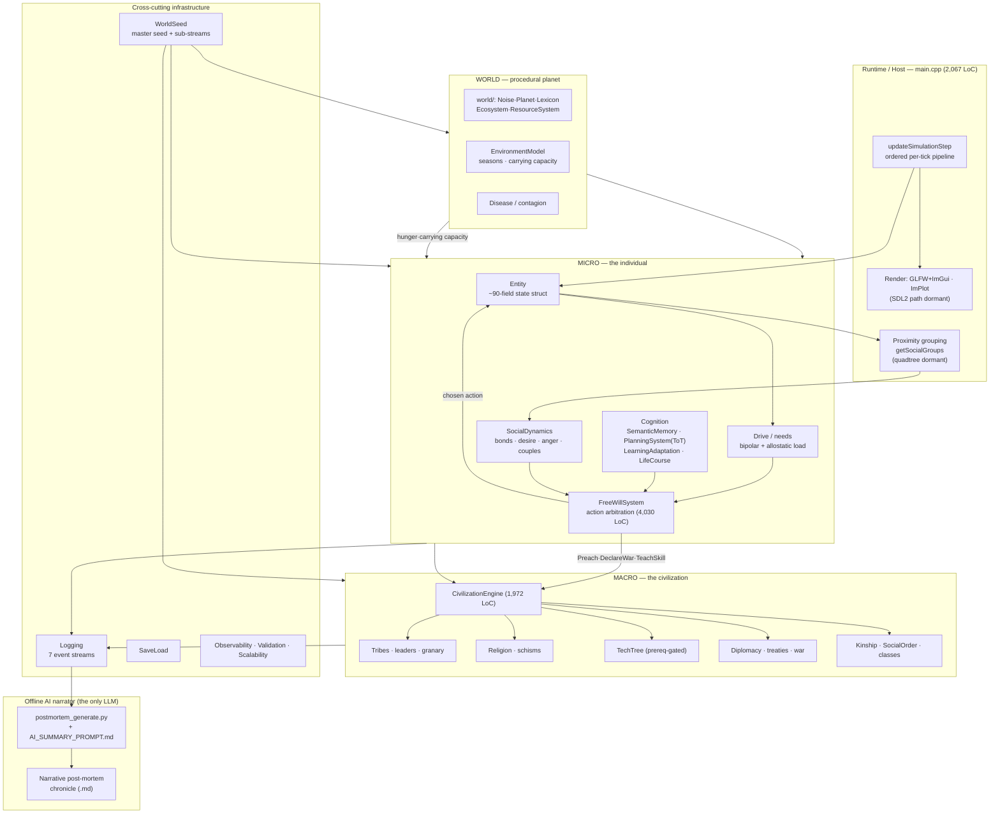

# 02 — Architecture

*A micro→macro stack: a host runtime ticks a population of deeply-modeled individuals; their choices and relationships aggregate into a civilization; a procedural planet gates them all; and an offline AI narrator reads the exhaust logs into a story.*

## The shape in one picture

## Layers, top to bottom

**1. Host runtime — `main.cpp` (2,067 LoC).** A single god-loop, `updateSimulationStep`, runs the ordered per-tick pipeline: advance environment/season → group entities by proximity + social bonds → spread disease → tick needs/relationships/grief → score & execute actions → movement → births/deaths (grief propagates to survivors). A `SpatialMesh` quadtree and a full force-directed movement system are both present but **dormant** — actual motion is spawn clustering plus civ migration, and live proximity grouping runs through `getSocialGroups`. Only the GLFW+ImGui backend is live; a second SDL2 path exists but is currently dead-wired. Detail in [09-simulation-loop-and-rendering.md](09-simulation-loop-and-rendering.md).

**2. Micro — the individual.** The `Entity` (a wide ~90-field struct) carries personality, a bipolar `DriveSet` with allostatic load, values, goals, memory, and identity IDs. The `FreeWillSystem` ([04](04-free-will-decision-engine.md)) is the decision core — it reads needs/emotion/memory/social context and picks one action per tick. Cognition ([05](05-cognition-memory-planning.md)) supplies memory bias, a Tree-of-Thoughts planner, RL-style learning, and life-stage gating. `SocialDynamics` ([06](06-relationships-and-social-order.md)) maintains proximity-decay dyadic links. See [03-entity-and-psychology.md](03-entity-and-psychology.md).

**3. Macro — the civilization.** `CivilizationEngine` ([07](07-civilization-engine.md)) is the aggregation layer: it grows tribes, spawns religions from leader personalities, gates innovation through a `TechTree`, runs diplomacy and war, and threads kinship/`SocialOrder` (family registry, classes, debt-slavery, inheritance). It is driven *by* the micro layer (individual actions like `DeclareWar`/`Preach`/`ChallengeLeader` bubble up) and pushes state back *down* (tribe membership, religion, war status modulate individual behavior).

**4. World — the procedural planet.** `src/world/` ([08](08-world-and-environment.md)) generates a seeded planet (hand-rolled fBm noise → biomes → rivers → isolated regions) with per-region `Lexicon` language drift, an `Ecosystem`, and a `ResourceSystem`. `EnvironmentModel` layers seasons + a Malthusian carrying-capacity loop so climate genuinely gates survival (famine → hunger → death → possible tech loss → dark age). Geography's isolation of regions is *the* engine of run-to-run divergence.

**5. Cross-cutting infrastructure** ([10](10-infrastructure-and-postmortem.md)). `WorldSeed` provides a master seed and salted sub-streams (`STREAM_TERRAIN/CULTURE/INNOV/DISEASE/NAMES`); `Logging` emits ~7 structured event streams (cmd/births/deaths/actions/diseases/relationships/events); `SaveLoad` persists; `Observability`/`ValidationFramework`/`Scalability` provide instrumentation.

**6. Offline AI narrator** ([10](10-infrastructure-and-postmortem.md)). The **only** LLM in the entire project runs *after* a simulation: `postmortem_generate.py` parses and deduplicates the log streams, computes statistics, and feeds `AI_SUMMARY_PROMPT.md` to an LLM to produce a narrative chronicle (see the two examples under `plans/`).

## Key architectural decisions

| Decision | Consequence |
|----------|-------------|
| **Algorithmic, not LLM, cognition** | Deterministic, fast, thousands of agents — but every behavior is a hand-tuned rule. |
| **Micro drives macro (bottom-up)** | History *emerges*; nothing is scripted. But macro balance is hostage to micro tuning (e.g. jealousy → a murder epidemic). |
| **One master seed → sub-streams** | Same seed reproduces a run — deterministic but **single-thread-only** (one shared global RNG + construction-order counter). An earlier "cognitive systems self-seed" gap the plans still warn about is already closed in code; see [10](10-infrastructure-and-postmortem.md). |
| **Logs as a first-class product** | The event streams are a clean contract that makes the offline AI narrator possible — arguably the most portable idea in the codebase. |
| **Dual render backends** | Flexibility (headless-ish SDL vs. rich ImGui) at the cost of two UI paths; long-run verification still needs a real desktop. |

## A defining pattern: ambitious-but-dead systems

A recurring architectural characteristic — visible already in the individual layer ([03](03-entity-and-psychology.md)) and the environment layer ([08](08-world-and-environment.md)) — is that **several sophisticated subsystems are fully written but never instantiated or ticked.** Confirmed so far: the entire `EmotionalComplexitySystem` (a full OCC appraisal→emotion + mood + contagion engine) and a Maslow `HierarchicalNeed` ladder exist as code but never run — live affect is the simpler bipolar-drive/PAD path. The `alternate-earth.md` plan documents the same for `EnvironmentModel`/`CulturalTransmissionSystem` (written, historically zero call-sites). 

This means ASHB2's *aspirational* architecture is materially larger than its *live* architecture. Each subsystem doc flags the live-vs-dead status explicitly, and [14-expansion-roadmap.md](14-expansion-roadmap.md) treats "wire the dead code you already wrote" as the single highest-leverage, lowest-risk expansion path.

## Module inventory (orientation)

`src/header/` names ~40 subsystems. Grouped:

- **Individual:** `Entity`, `Drive`, `EmotionalComplexity`, `CognitiveArchitecture`, `JungianType`, `PersonaSystem`, `SemanticMemory`, `PlanningSystem`, `LearningAdaptation`, `LifeCourse`, `Movement`, `BehavioralModule`.
- **Social:** `SocialDynamics`, `SocialOrder`, `SocialNormSystem`, `Kinship`, `Heritage`, `CommunicationBasis`, `Graph`.
- **Civilization:** `CivilizationEngine`, `TechTree`, `Diplomacy`, `Economics`, `NarrativeEngine`.
- **World:** `world/{Noise,Planet,PlanetView,Lexicon,Ecosystem,ResourceSystem}`, `environment/EnvironmentModel`, `Disease`, `EnvironmentalInteraction`, `WorldMap`, `WorldSeed`.
- **Infra/UI:** `main`, `UI`, `SDLEngine`, `SpatialMesh`, `SaveLoad`, `Logging`, `observability/Observability`, `validation/ValidationFramework`, `scalability/Scalability`, `Action`, `Image`.

The subsystem documents that follow ([03](03-entity-and-psychology.md)–[10](10-infrastructure-and-postmortem.md)) each take one of these groups and trace the *live* code path through it.
