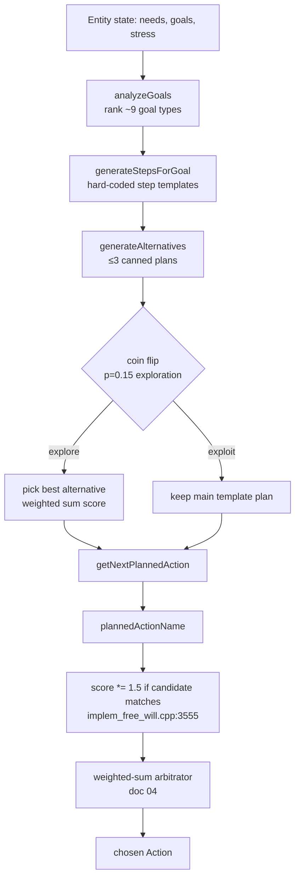

# 05 — Cognition: Memory, Planning & Learning

*The "higher mind" tier of ASHB2 — a 64-dim memory stream, a template planner wearing a "Tree-of-Thoughts" nameplate, a 24-bucket Q-table, and a whole life-course engine that is never switched on.*

This document covers the four subsystems that sit *above* raw drives: how memories are stored, embedded, and retrieved; how "formative" events nudge personality; how the planner turns goals into action; how reinforcement learning feeds the decision core; and how life stages gate behavior. As with the rest of the series, the recurring theme is **ambition-vs-liveness**: some of the most elaborately-engineered code here is dead. See `03-entity-and-psychology.md` for the personality substrate these systems mutate, and `04-free-will-decision-engine.md` for the weighted-sum arbitrator every "bias" below plugs into.

## By the numbers

| Module | File | LoC | Status | Notes |
|---|---|---|---|---|
| SemanticMemorySystem | `SemanticMemory.cpp` | 596 | **LIVE** | 64-dim embeddings, cosine top-K, feeds decision weight |
| PlanningSystem ("ToT") | `PlanningSystem.cpp` | 798 | **LIVE (shallow)** | 5 goal types, ≤3 canned "alternatives", depth 1 |
| LearningAdaptationSystem | `LearningAdaptation.cpp` | 517 | **~15% LIVE** | Only the Q-table slice runs; habits/skills/culture dead |
| LifeCourseSystem | `LifeCourse.cpp` | 582 | **DEAD** | Class never instantiated; life-stage gating lives elsewhere |
| CognitiveArchitecture | `CognitiveArchitecture.cpp` | ~350 | **DEAD** | Referenced only by its own header |
| JungianStack (`cognition`) | `JungianType.cpp` | ~300 | **SEMI-LIVE** | Feeds inner-monologue text only, not decisions |
| PersonaSystem | `PersonaSystem.cpp` | ~300 | **DEAD-in-loop** | Header included; no decision path found |

Key constants: embedding dimension **64** (`EmbeddingConfig`, `SemanticMemory.h:74`); memory time-decay constant **300 days** (`SemanticMemory.cpp:134,197`); ToT `maxAlternatives` **3**, `maxPlanSteps` **8**, `planHorizonDays` **1**, `explorationRate` **0.15** (`PlanningSystem.h:123`); Q-learning `learningRate` **0.1**, default Q **50** (`LearningAdaptation.cpp:27,42`); RL state space ≈ **24 buckets** (4-char signature). LifeMemory has **no capacity cap** (unbounded `std::vector`).

---

## 1. Semantic memory — the one that actually runs

Each entity owns two memory structures. The raw store is `entity->lifeMemories`, a vector of `LifeMemory` structs (`Entity.h:58`): `{eventType, entityInvolvedId, emotionalIntensity, simulationDay, isFormative, internalNarrative}`. On construction and on load the entity calls `semanticMemory.rebuildFromLifeMemories(this)` (`Entity.cpp:49,142,558`), which embeds every raw memory into the vector database.

**Embedding** (`SemanticMemory.cpp:116` `generateEmbedding`) is hand-rolled, not learned: 6 event-type one-hot slots (`encodeEventType`, line 29), 4 emotional-intensity transforms, 2 recency features (`exp(-dayAge/300)`), 8 lexical features from `extractKeywordFeatures` (line 53 — counts positive/negative/social/threat/trust keywords in the narrative), then hash-derived noise padding out to 64 dims, finally L2-normalized. It is a bag-of-features vector, but the plumbing (cosine similarity, top-K, decay) is genuine.

**Retrieval** (`searchRelevantMemories`, line 315) scores every memory against a query embedding:

```cpp
float finalScore = decayedScore * entityBoost * formativeBoost * emotionalBonus;
// entityBoost 1.5 (same person), formativeBoost 1.3, emotionalBonus 1+0.3*intensity
```

Time decay reuses the 300-day exponential. There are also convenience queries: `getMemoriesAboutEntity` (used by the social layer — see `06-relationships-and-social-order.md`) and `getSignificantMemories` (formative memories get a 2× score).

**Into the decision:** `FreeWillSystem::calculateSemanticMemoryBias` (`implem_free_will.cpp:3695`) builds a `MemoryQuery` from the current encounter and calls `calculateMemoryActionBias` (`SemanticMemory.cpp:422`), which maps retrieved event types onto action nudges (`positive_bond`→+0.15 on socialize/flirt; `trauma`/`loss_death`→−0.2 on social, +0.1 on attack/defend; `betrayal`→−0.15 on trust). The result returns as a multiplicative modifier `1.0 + memoryBias` and is applied at `implem_free_will.cpp:1640` (`weight *= semanticMemoryBias`). This is the live memory→bias→decision loop.

### Formative memories → trait drift

Here the honest story diverges from the marketing. "Formative memory permanently shifts personality" is really **two loosely-coupled mechanisms**, and neither is triggered by the `isFormative` flag directly:

1. **`calculateLifeMemoryBias`** (`implem_free_will.cpp:191`) — a *separate* legacy path from the semantic one. It walks raw `lifeMemories`, decays each by age, and multiplies intensity by **2.5× when `isFormative`** (line 199). So formative flags amplify *biasing*, but only tilt action scores; they don't mutate traits.
2. **`updatePersonalityFromExperience`** (`implem_free_will.cpp:1289`, called at line 3014 after each action) — the actual trait mutator. It is a hand-coded `if (act.name == ...)` table nudging Big Five and `SelfConcept` fields: Murder/SelfHarm → +neuroticism, −agreeableness; successful Socialize → +agreeableness, +openness, +selfEsteem; Prayer → +conscientiousness. Keyed on **action name, not the formative flag or memory content.**

The `isFormative` flag itself is set by crude heuristics: `griefIntensity > 0.6` (`main.cpp:233`) or `lifeMemories.size() < 3` (the entity's first three memories are automatically "formative", `implem_free_will.cpp:2313,2710,2796`). So personality drift is real and continuous, but the clean "formative event permanently rewrites the trait" narrative is an emergent side-effect of the action-outcome nudge loop, not a dedicated mechanism. See `03-entity-and-psychology.md` for how these drifts accumulate against the baseline traits.

Note the LearningAdaptation module *also* defines `updatePersonalityFromExperience` + a `PersonalityChangeTracker` with a tidy drift-accumulate-then-apply design (`LearningAdaptation.cpp:206-253`). That version is **never called** — the engine uses its own inline copy instead.

---

## 2. The "Tree-of-Thoughts" planner — a template selector

`PlanningSystem` is live: `entity->planner.generateDailyPlan()` and `getNextPlannedAction()` are invoked through `FreeWillSystem::getPlannedAction` (`implem_free_will.cpp:3732`), which is called during candidate generation (`implem_free_will.cpp:3522`). But calling it "Tree-of-Thoughts" is aspirational.

**How it actually works:**
- `analyzeGoals` (`PlanningSystem.cpp:27`) ranks goals from entity state: survival (health<30 or stress>70), urgent needs (urgency>80), socialize (lonely/bored), the 5 life-goal types (`find_partner`, `build_career`, `make_friends`, `build_family`, `happiness`) read off `entity->m_goals`, and mood repair.
- `generateStepsForGoal` (line 202) emits **hard-coded step templates** per goal — e.g. a social goal always yields approach → `kind_action` → `socialize`. No search.
- `generateAlternatives` (line 334), the supposed ToT branching, appends **at most 3 canned plans** (survival-focus, social-focus, career-focus), each gated by a threshold and populated with literal `PlanStep`s. `evaluateAlternative` (line 315) scores them with a weighted sum: `0.4*success + 0.6*satisfaction`, times a personality multiplier.
- Selection: with probability `explorationRate` (0.15) it swaps in the best alternative; otherwise it keeps the main template plan (`generateDailyPlan`, line 507).

There is **no tree, no depth, no lookahead, no rollout, no branch expansion.** Branch factor is ≤3, depth is 1, horizon is a single "day". The alternatives are static hand-written plans selected by a coin flip. It is a **1-ply heuristic template picker.** "Tree-of-Thoughts" describes the ambition, not the algorithm.

**Influence on behavior is also weak:** the chosen planned action only grants `score *= 1.5f` when a candidate's name matches (`implem_free_will.cpp:3555`). It is one nudge among a dozen multiplicative modifiers — easily overwhelmed. `reportActionResult` (line 562) tracks `cumulativeFrustration` to trigger re-planning, and `generatePlanReflection` (line 648) produces flavor text ("The plan went well…") that is not fed back into anything numeric.



---

## 3. Learning & adaptation — one live Q-table in a graveyard

`LearningAdaptationSystem rlSystem` lives on `FreeWillSystem` (`FreeWillSystem.h:218`). Of its five subsystems — Q-values, habits, skills, cultural transmission, personality-change tracking — **only the Q-table is wired in.**

**The live path** is exactly the `rlStateSignature` Q-table introduced in `04-free-will-decision-engine.md`. The state is a 4-char bucket (`implem_free_will.cpp:1539`):

```cpp
s += b3(entity->entityLoneliness);              // L / M / H
s += (entity->entityGeneralAnger > 50 ? "a":"_");
s += (entity->entityHunger      > 50 ? "h":"_");
s += (numNearby > 0             ? "p":"s");      // people vs solo
```

That is ≈24 reachable states. After acting, `rlSystem.processExperience(entity, preState, action, reward, nextState)` (`implem_free_will.cpp:2970`) runs a textbook tabular Q-update (`LearningAdaptation.cpp:10`, lr 0.1, default Q 50). When scoring candidates, the learned value is read back and applied as a **±40% multiplier**:

```cpp
float q = rlSystem.getActionValue(entity->getId(), rlState, an);
score *= (0.6f + 0.8f * (q / 100.0f));   // implem_free_will.cpp:3621
```

So learning *does* meaningfully bias choice — an action that repeatedly paid off in "lonely+solo" gets boosted next time that bucket recurs. But 24 states is extremely coarse: it cannot distinguish partners, locations, or goals, so what's learned is little more than "when lonely and alone, socializing tends to help."

**The dead 85%:** `selectActionRL` (habit-overrides-deliberation, line 310), `reinforceHabit`/`updateHabits` (the `HabitStrength` model with context cues and consistency, lines 89-123), `practiceSkill`/`Skill` (proficiency/automaticity/decay curves, lines 125-159), `observeAndLearn`/`CulturalTransmission` (prestige/conformity/similarity-biased imitation, lines 161-203), and `PersonalityChangeTracker` — **none are called anywhere in the engine.** The `saveTo` even admits it (line 487): "*Full Q-table serialization would be very large*" — so it only persists three learning-rate floats and throws the learned Q-values away on save/load. Learning does not survive a save.

---

## 4. Life course — the fully-dead engine, and the gating that survived it

`LifeCourseSystem` (582 LoC) is the cleanest example of an ambitious-but-dead system in this tier. It models `CareerPath` (promotions, occupation levels, job satisfaction), `RelationshipLifecycle` (a 9-stage strangers→married→separated state machine), `ParentingStyle` (Baumrind's authoritative/authoritarian/permissive/neglectful quadrants), `AgingEffects` (physical/cognitive decline, wisdom accumulation, shrinking time-horizon, generativity peaking at 52.5), and `DevelopmentalMilestones`. **None of it runs** — `grep` finds `LifeCourseSystem` referenced only inside `LifeCourse.cpp`/`.h`. It is never instantiated on an entity, never ticked, never saved by the world.

Yet **life-stage gating does exist** — it was simply reimplemented outside the dead class. The `LifeStage` enum `{INFANT, CHILD, ADOLESCENT, ADULT, ELDER}` (`Entity.h:159`) is a plain field on the entity, aged directly in `Entity.cpp:180-192`, and used to gate capabilities:
- **Reproduction/romance** gated by adulthood: childhood must "complete" first (`implem_free_will.cpp:335,411`, `=== CHILDHOOD COMPLETE ===`).
- **Movement/behavior** differs by stage in `WorldMap.cpp:62-69` (adults/elders vs children/adolescents).
- **Elder effects** applied in `Entity.cpp:192`.

So the *capability gating* the life-course engine was designed to own is real, but crude and scattered — a handful of `if (stage == ADULT)` checks rather than the rich `AgingEffects` curves sitting unused in the dead file.

---

## 5. Self-concept, mental models, and the inner voice

Three smaller cognitive structures round out the tier:

- **`SelfConcept`** (`Entity.h:77`) — perceived Big Five, `selfEsteem`, `selfEfficacy`, `calibration` (how self-view matches how others see me). **Live:** mutated on every action by `updatePersonalityFromExperience` (§1). Actions off the recognized list slowly erode self-efficacy (`implem_free_will.cpp:1328`).
- **`MentalModelOfOther`** (`Entity.h:192`) — per-neighbor estimates of their traits, mood, `trustLevel`, `predictability`, `perceivedIntentionality`, updated via `updateFromObservation`. This is the theory-of-mind substrate used by the social layer (`06-relationships-and-social-order.md`).
- **`innerMonologue`** (`Entity.h:275`) — first-person narration. Set from three sources: the reflex layer (`"[reflex] " + reason`, `implem_free_will.cpp:1223`), `NarrativeEngine::innerMonologue`, and — notably — `entity->cognition.gripNarrative()` (`main.cpp:1108`), the **JungianStack**. This is the only place the Jungian cognitive-function stack touches anything: it colors the *narration*, never the *decision*. A `grep` for `cognition.` in the decision engine returns nothing. So the MBTI/Beebe machinery the author considers the "cognitive spine" (`Entity.h:298`) is, in the running sim, a flavor-text generator. `CognitiveArchitecture` and `PersonaSystem` are darker still — included headers with no live decision path.

This matters for the author's Gap 1 (arbitration): the design intends MBTI cognitive stacks to decide *which system is in charge*, but in code the stack is inert and arbitration remains the flat weighted sum of `04-free-will-decision-engine.md`.

---

## Honest scorecard

- **Semantic memory:** genuinely live and reasonably designed — the strongest module in this tier. Embeddings are hand-features, not learned, but retrieval and the memory→bias loop work.
- **ToT planner:** live but a **template selector, not a search.** No tree, depth 1, ≤3 canned alternatives, 1.5× nudge. The name oversells by an order of magnitude.
- **RL:** a **real but tiny** tabular Q-learner (≈24 states, ±40% effect) that meaningfully biases choice but is too coarse to learn anything specific — and doesn't persist across saves.
- **Life course:** **dead.** Rich career/relationship/aging/parenting models, zero of it ticked; gating survives as scattered `if (stage==ADULT)` checks.
- **Jungian / CognitiveArchitecture / PersonaSystem:** **dead-to-decisions**; Jungian stack survives as inner-monologue flavor only.

---

## Ideas worth stealing for petri-dish-of-madness

- **The memory-stream → formative-event → trait-drift loop is the keeper.** ASHB2's `LifeMemory` + embedding + retrieval + `calculateMemoryActionBias` is a lightweight, LLM-free cousin of generative-agents' memory stream (retrieval by recency × importance × relevance). Steal the *structure* but fix the wiring: make the `isFormative` flag actually gate a distinct, larger trait mutation, and unify the two rival `updatePersonalityFromExperience` implementations into one.
- **The cheap ToT scaffold is worth keeping as scaffolding — then make it branch.** The goal→steps→alternatives→evaluate pipeline is a clean skeleton. Adding even 2-ply lookahead with a cheap outcome simulator (roll each alternative forward against the need model) would turn the template picker into something that earns the "tree" name, at negligible cost.
- **Coarse-bucket tabular RL is a great low-cost habit substrate — widen the state and persist it.** The `rlStateSignature` trick (hash the situation to a short string, tabular Q) is a cheap way to get real learning without gradients. Expand the signature to include goal/partner/location, and actually serialize the Q-table so learned dispositions survive a life.
- **Harvest the dead LifeCourse curves.** `AgingEffects` (time-horizon shrink, present-focus rise, generativity curve) is exactly the age→time-discounting coupling a life-course sim needs. It's already written — the win is just instantiating and ticking it instead of the scattered stage checks.
