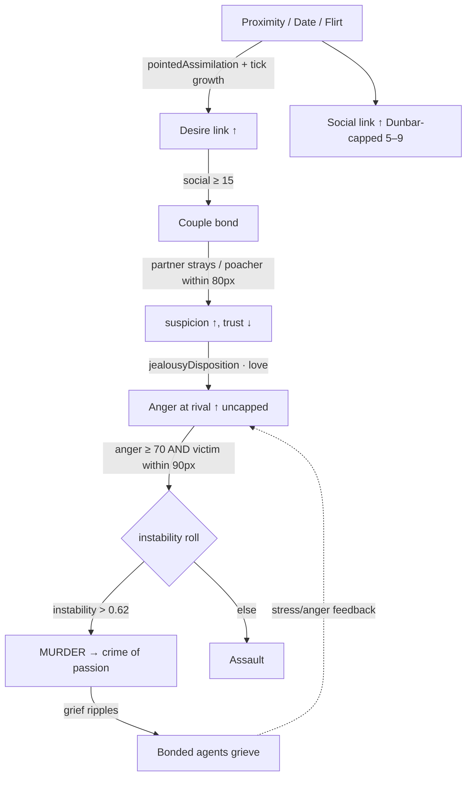
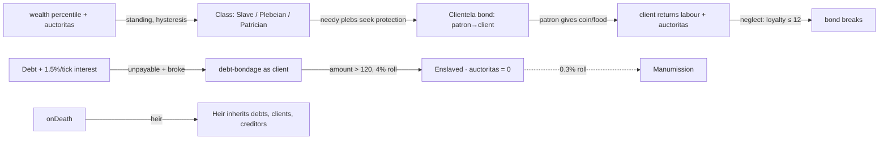

# 06 — Relationships & Social Order

*How ASHB2 builds society out of three per-pair scalars — and how one of them (jealousy) quietly became the leading cause of death.*

ASHB2 has no relationship database and no social graph object. Instead every agent carries four small vectors of **dyadic links** — one entry per person it has feelings about — and social structure is whatever those links happen to aggregate into. On top of that thin substrate sit two id-keyed registries: a **kinship** layer (families, lineage, incest rules) and a **social-order** layer (classes, patron–client bonds, debt, slavery, inheritance). This document traces the dyad → couple → jealousy → murder pipeline that dominates mortality, then the stratification layer, and flags which modules are actually alive.

## By the numbers

| Thing | Value | Source |
|---|---|---|
| Dyadic link types per agent | 4: `Social`, `Desire`, `Anger`, `Couple` | `Entity.h:214–242` |
| Couple sub-scalars | commitment(50) · satisfaction(60) · trust(65) · suspicion(0) · daysTogether | `Entity.h:233–242` |
| Dunbar cap (social links) | **5 base → 5–9** by extraversion | `main.cpp:647–648` |
| Desire proximity growth / decay | +0.006·prox/tick (≤140px) / 0.002–0.012 | `main.cpp:607–628` |
| Social class ladder | Slave / Plebeian / Patrician | `SocialOrder.h:14–18` |
| LoC (live) | Kinship 118+66, SocialOrder 372+111 | — |
| LoC (dead) | SocialDynamics 405+219, Heritage 20+18, SocialNormSystem 29 | — |
| **Crime-of-passion deaths, run A** | **772 / 867 = 89.0%** | `29.06.2026-12h43.md` |
| **Crime-of-passion deaths, run B** | **286 / 322 = 88.8%** | `28.06.2026_22h17.md` |
| Deaths by old age, run A | **4** (murder is 193× more likely) | `29.06` |
| `Jealousy` *actions* logged vs murders (run B) | **1 logged** vs 286 killings | `28.06` |
| Couples / dates / flirts, run A | 653 / 61,346 / 42,198 | `29.06` |

The two headline stats — 89.0% and 88.8% crime-of-passion across independent seeds — are not noise. Jealousy is the mortality engine.

## The dyadic link model

Each agent holds four parallel adjacency lists (`Entity.h:276–279`), all keyed by a raw `Entity*` plus a 0–100 scalar:

- `list_entityPointedSocial` — platonic bond strength.
- `list_entityPointedDesire` — romantic/sexual attraction.
- `list_entityPointedAnger` — resentment.
- `list_entityPointedCouple` — an active partnership, with its own richer state (`commitment/satisfaction/trust/suspicion/daysTogether`).

**Growth has two sources.** (1) *Actions*: when an agent runs a pointed social action, `FreeWillSystem::pointedAssimilation` (`implem_free_will.cpp:2038`) nudges the relevant scalar — e.g. `Desire` seeds a link at 10–25·attractiveness and reinforces it in tiered increments, and crucially adds *reciprocal* desire back to the target (`:2104–2125`) so mutual attraction can bootstrap. (2) *Passive proximity*: every tick, `tickRelationshipDecay` grows social **and** desire links purely from being physically near (`main.cpp:576–628`) — bonds strengthen just by standing close.

**Decay** is scalar-dependent: strong links barely fade (0.001–0.002/tick), weak ones bleed faster (0.008–0.012); anger fades at a **forgiveness rate scaled by agreeableness** (`main.cpp:630–635`). Attachment style and the Big Five thread through everywhere — see `03-entity-and-psychology.md`.

**The Dunbar cap** is the one deliberate governor (`main.cpp:643–654`). Only *social* links are capped, at `5 + extraversion/100·4` (5–9). When exceeded, the list is sorted by strength and the weakest are dropped:

```cpp
int socialCap = baseCap + (int)(ent->personality.extraversion / 100.0f * 4.0f); // 5–9
if ((int)ent->list_entityPointedSocial.size() > socialCap) {
    std::sort(... a.social > b.social);      // keep the strongest
    ent->list_entityPointedSocial.resize(socialCap);
}
```

The stated rationale (comment at `:643`) is telling: without it, passive proximity floods agents with dozens of weak friendships that "crowd out desire/anger bonds." Note the asymmetry — **desire, anger and couple links are uncapped.** That is a load-bearing design choice for the murder epidemic below.

## Couples: forming and breaking

A couple forms through the `couple` action branch (`implem_free_will.cpp:2505–2551`), gated on an existing social link ≥ 15 (below that it just deepens the friendship and returns). In practice most couples are bootstrapped by the **romantic side-drive** in the main loop (`main.cpp:1288–1304`): after any pointed action there is a 45% chance to fire a desire-linked action (`Flirt`/`Date`/`couple`/`breeding`) against the most-desired nearby mate and assimilate it. This is why `Date` (23,734) and `Flirt` (16,373) dwarf every other action in run B — courtship is the ambient behaviour.

Once coupled, `updateMovement` pulls partners to within **22px** of each other (`main.cpp:670–683`) — they orbit permanently, which keeps desire growing from proximity and keeps rivals inside detection range. Breakups happen in `processSocialConsequences` when `trust < 12` or `satisfaction < 12` (a 12% roll, `:4011–4026`); the observed separation rate is only ~3.4% because trust collapse is rare relative to how fast jealousy escalates to killing.

## Jealousy → crime of passion (the runaway)

This is the heart of the system, and it lives entirely in `FreeWillSystem::processSocialConsequences` (`implem_free_will.cpp:3780–4030`), called **every tick for every partnered agent** from `main.cpp:1389` — *outside* the free-will action lottery. That decoupling explains the post-mortem paradox: the `Jealousy` action fired once (run B) while 286 people were murdered. The killings never went through the action system at all.

Per couple, per tick:

1. **Threat scan** (`:3809–3841`): find a `rival` from (a) the partner's other couple bonds, (b) the partner desiring someone else (>25), or (c) an *outsider* who desires my partner (>30). Seeing the poacher within 80px multiplies the threat 1.6× ("seeing it stings more").
2. **Suspicion dynamics** (`:3843–3857`): threat raises `suspicion`, erodes `trust`/`satisfaction`, and spikes the agent's stress; no threat → everything quietly heals.
3. **Jealous reaction** (`:3859–3879`): dump anger onto the rival (and a fraction onto the disloyal partner), scaled by `jealousyDisposition` — a personality function (`:3763–3778`) where neuroticism + disagreeableness + anxious/disorganized attachment + family-orientation push it toward 1.0.
4. **Crime of passion** (`:3881–3946`): if accumulated anger at the rival ≥ 70 (or ≥ 78 at the partner) and the victim is within 90px, roll against an `instability` term (mental-health deficit + stress + disposition). On success: `assault` or, if `instability > 0.62`, **`murder`** — victim health set to 0, `pendingDeathCause = "crime of passion by <name>"`, grief rippled to everyone bonded to the victim.



**Why it dominates — and why it's a balance problem.** The reinforcing conditions all point the same way:

- **Uncapped anger + permanent proximity.** Couples orbit at 22px and the crime radius is 90px, so a rival is almost always in reach. Anger has no Dunbar cap, so it only accumulates.
- **Packed geography.** Both runs had few habitable regions (3/14, 1/26), forcing dense cradles → every partner is surrounded by potential poachers → the threat scan almost never comes up empty.
- **Runs every tick, ungated by the action economy.** Unlike murder-via-action (explicitly suppressed in the side-drives, `main.cpp:1306–1309`), passion-killing has no rate limiter beyond the instability roll.
- **Grief feedback.** Each kill grieves the victim's bonded partners, raising *their* stress and anger — priming the next killing.

The result is a society where median age at death is 15–16, adolescents absorb 59% of violent deaths (peak romantic competition), and a 70%-secure-attachment founding population still murders its way to an 89% homicide mortality rate. This is emergent drama working *too well*: realistic ingredients (mate-guarding, insecurity, jealousy) with no damping produce a caricature. A realism pass would cap anger, add a cooldown after a killing, make lethal instability far rarer, or give agents non-violent jealousy outlets that actually win the action lottery.

## Kinship registry & incest avoidance

`KinshipSystem` (`Kinship.cpp`, **LIVE** — `globalKinship` created at `main.cpp:1949`) is the id-based lineage layer that replaced the crash-prone pointer graph. `registerBirth` (`:51–77`) stamps `parent1Id/parent2Id` on the child, appends it to each parent's `childrenIds`, and assigns it the senior parent's `Family` (founding one if needed). Founders with no parents found their own houses.

Incest avoidance is three predicates (`:80–98`):

```cpp
bool wouldBeIncest(a, b) {
    if (a.entityId == b.entityId) return true;   // self
    if (isParentChild(a, b))      return true;   // direct lineage
    if (shareParent(a, b))        return true;   // full/half siblings
}
```

Cousins are **intentionally allowed** (comment at `Kinship.h:47`). Two honest edge cases:
- The check is only wired into the **couple-continuity auto-conception path** (`implem_free_will.cpp:3959`). The older action-driven `breeding` branch (`:2307`, `:2385`) registers births with no `wouldBeIncest` gate — so sibling breeding is possible through that route.
- `shareParent` requires `parent id ≥ 0`, so any two agents with unknown parentage (all founders, and lineage-less births) are never flagged as siblings even if they share an unrecorded ancestor.

Family reputation (0–100) nudges up on healthy births and feeds marriage prospects / tribe standing — the hand-off to `07-civilization-engine.md`.

## Social stratification (patron–client, debt, slavery, inheritance)

`SocialOrderSystem` (`SocialOrder.cpp`, **LIVE** — created `main.cpp:1956`, ticked `:1542`) is a deterministic, seed-driven Roman-esque order. Everything is id-keyed (`bonds`, `debts`) so it survives entity-vector reallocation. Its `tick` (`:359–367`) runs five phases:



- **Classes** (`updateClasses:99–146`): `standing = 0.6·wealthPct + 0.4·auctoritas`. Ascent to Patrician needs standing > 0.88 *and* auctoritas > 60; you fall only on real collapse (< 0.45 and < 45). Hysteresis makes rank sticky. Auctoritas itself drifts toward `dominanceRank + clientCount + wealth`.
- **Clientela** (`updateClientela:149–188`): only *needy* plebs (poor / indebted / stressed) seek a patron within 220px; patrons have a client cap of `auctoritas/12`. `applyBondEffects` (`:194–226`) transfers coin/food down and labour/loyalty/auctoritas up; a neglected client's loyalty decays until the bond breaks at ≤ 12.
- **Debt → slavery cascade** (`updateDebtConsequences:229–292`): debts accrue 1.5%/tick; a broke debtor with > 25 owed is pushed into debt-bondage, and with > 120 owed a 4% roll enslaves them (`auctoritas → 0`). Rare 0.3% manumission is the only escape.
- **Inheritance** (`onDeath:295–325`): called from the death handler (`main.cpp:1446`) with the eldest living child as heir; the heir inherits debts owed and owing *and* becomes the new patron of the deceased's clients. No heir → obligations dissolve.

Emergent note: the post-mortems don't foreground class much because agents die of jealousy long before debt spirals mature — the stratification layer is real but under-exercised at these lifespans.

## Live vs dead modules

| Module | Status | Evidence |
|---|---|---|
| Kinship (`Kinship.cpp`) | **LIVE** | `globalKinship` created, `registerBirth`/`wouldBeIncest` called |
| SocialOrder (`SocialOrder.cpp`) | **LIVE** | `tick`/`onDeath` called each civ tick |
| Dyadic links + jealousy (`Entity.h`, `implem_free_will.cpp`) | **LIVE** | `processSocialConsequences` every tick |
| **SocialDynamics** (`SocialDynamics.cpp`, 405 LoC) | **DEAD** | compiled in CMake but `SocialDynamicsSystem` is **never instantiated** |
| **SocialNormSystem** (`SocialNormSystem.h`) | **DEAD** | `update()` never called; per-entity `socialNorm` struct is inert |
| **Heritage** (`Heritage.cpp`) | **DEAD** | only `UnlinkedNode` called at spawn; `add_child` mutates a loop copy and records nothing; superseded by Kinship |

`SocialDynamics.cpp` is the poignant one: a full Sternberg-triangular-theory relationship model (intimacy/passion/commitment), groups, reputation, gossip propagation, in-group bias — 624 lines, cleanly written, **entirely unwired.** The live system is the cruder four-scalar dyad model instead.

## Cross-references

- `03-entity-and-psychology.md` — attachment style and the Big Five drive `jealousyDisposition` and bonding rates.
- `04-free-will-decision-engine.md` — `Flirt`/`Date`/`couple`/`Murder` actions, the romantic and hostile side-drives, and why passion-killing bypasses the action lottery.
- `07-civilization-engine.md` — kinship families feed tribes, inheritance, and the class ladder; the `SocialOrder` tick is scheduled from the civilization loop.

## Ideas worth stealing for petri-dish-of-madness

- **Proximity-decay dyadic links as the whole relationship substrate.** Four `vector<{Entity*, float}>` per agent + growth-from-nearness + strength-tiered decay is a shockingly cheap way to get emergent friendship/attraction/grudge networks with zero graph machinery. Add a per-list Dunbar cap and social structure just falls out.
- **Jealousy as an emergent-drama engine — but damped.** A per-tick threat-scan → suspicion → mate-guarding-anger → violence loop generates genuinely story-shaped tragedy (love triangles, crimes of passion, dynasties torn apart). ASHB2 proves it works *and* proves it needs governors: cap the aggression scalar, cooldown after a kill, non-violent outlets. Steal the mechanism, keep the safety valve.
- **Decouple slow "consequence" systems from the fast action lottery.** Running jealousy, debt interest, and class drift on their own tick — independent of what an agent "chose" to do — is why rare-but-important dynamics actually fire. Model the substrate continuously, let the agent only pick surface behaviour.
- **Id-keyed registries that outlive reallocation.** Both live layers (Kinship, SocialOrder) store integer ids, never `Entity*`, so a growing/shrinking population never dangles a pointer. The dead pointer-based `Heritage` graph is the cautionary tale sitting right next to them.
