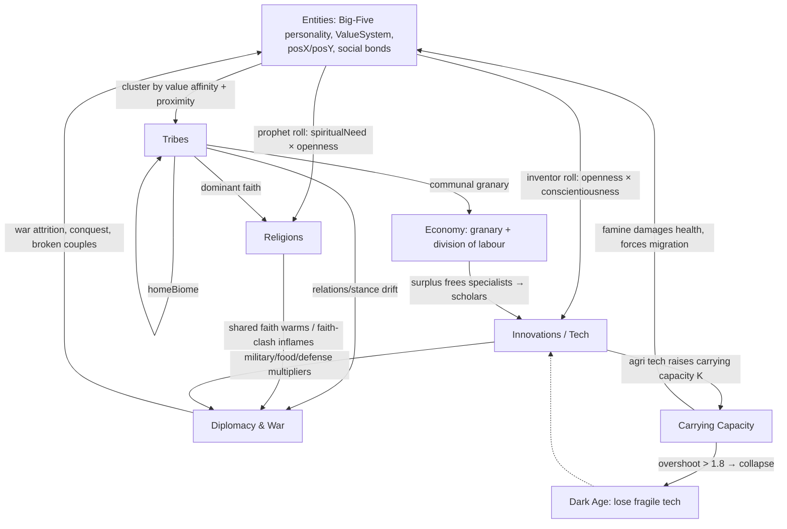
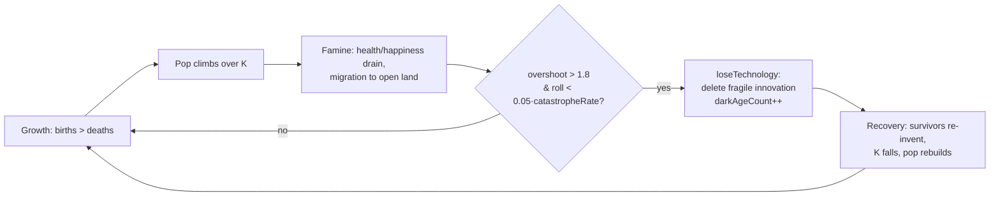

# 07 — The Civilization Engine

*How a loose blob of agents self-assembles into tribes, faiths, tech ladders, empires and dark ages — all algorithmically, once per civ-tick, from the same personality traits the individuals already carry.*

`CivilizationEngine` is ASHB2's macro layer. The micro layer (Entity, FreeWillSystem, Kinship — docs 04–06) simulates individuals; the civ engine reads that swarm every few frames and *aggregates* it into groups. It owns no per-frame agency of its own — it is a batch reducer that runs `tick(entities, day)` and mutates both its own group structures (`tribes`, `religions`, `innovations`, `treaties`) and the entities back (assigning `tribeId`, `religionId`, `specialization`, famine damage). One `extern CivilizationEngine* globalCivEngine` is created in `main.cpp:~1440`, ticked at `main.cpp:1537-1538` — and only every 5th civ-window (`(day/UPDATE_FREQUENCY)%5==0`, `UPDATE_FREQUENCY=60`).

## By the numbers

| Thing | Value | Source |
|---|---|---|
| `CivilizationEngine.cpp` | 1972 LoC | the whole macro layer |
| `CivilizationEngine.h` | 326 LoC | structs: `Tribe`, `Religion`, `Innovation`, `Treaty`, `CivEvent` |
| Cultural value axes | **4** — militarism, spiritualism, collectivism, innovation | `Tribe`, `CivilizationEngine.h:61-64` |
| Emergent innovation catalog | **31** (agri 5 / tool 6 / medicine 5 / social 6 / military 4 / spiritual 5) | `CATALOG`, `CivilizationEngine.cpp:23-61` |
| Structured tech-tree nodes | **14** (tiers 0–3, stone→iron) | `kTree`, `TechTree.cpp:13-49` |
| Diplomacy stances | **4** — `TS_NEUTRAL/ALLY/RIVAL/AT_WAR` | `CivilizationEngine.h:51` |
| Formal treaty types | **4** — `PEACE/ALLIANCE/TRADE/TRIBUTE` | `CivilizationEngine.h:112-117` |
| Eras | **9** — Stone Age … Modern | `CivilizationEra`, `CivilizationEngine.h:148-158` |
| `TechTree.cpp` (151 LoC) | **LIVE** | called from `CivilizationEngine.cpp:1215,1316,1743,1755,1899` |
| `Diplomacy.cpp` (267 LoC) | **LIVE** | `updateDiplomacy` called `CivilizationEngine.cpp:79` |
| `Economics.cpp` (284 LoC) | **LIVE but parallel** | `g_market` ticked in `main.cpp:1566`, *not* by the civ engine |
| `NarrativeEngine.cpp` (220 LoC) | **LIVE but parallel** | prose log, called from `main.cpp`, not the civ engine |

## The tick pipeline

`tick()` (`CivilizationEngine.cpp:68-125`) runs a fixed phase order every civ-tick:

```
removeDead → updateDominanceRanks → updateTribes → updateReligions
→ updateInnovations → updateTribeRelations → updateDiplomacy → processWarTick
→ updateCarryingCapacity → updateEra → applyEffectsToEntities
→ updateDivisionOfLabour → updateTechTree → (lexicon drift, history fingerprint)
```



## 1. Blob → tribes

**Formation** (`updateTribes`, `:157-228`). Each tick the engine collects tribeless adults (`age>16`) and greedily clusters them: two entities join if they are geographically near (`dist² < 250²`) **and** value-similar (`valDiff<32`, weighted collectivism/spiritualNeed/achievementDrive) **or** already socially bonded (`bond>12`). A cluster of ≥3 becomes a tribe via `formTribe` (`:230-273`) — but **one new tribe per tick**, so populations grow tribes gradually. The geographic gate (`:174, 207`) is the mechanism that keeps separated cradles from merging into one monoculture — the divergence lever from `alternate-earth.md`.

**Leaders** are not elected democratically — the highest `dominanceRank` member wins (`electLeader`, `:275-294`). `dominanceRank` (`updateDominanceRanks`, `:128-149`) = charisma·0.5 + summed social bonds + summed fear/anger others hold toward you + a leadership incumbency bonus. Charisma itself (`computeCharisma`, `:1949`) is a fixed Big-Five blend (extraversion 0.35, agreeableness 0.25, conscientiousness 0.20, −neuroticism 0.15, openness 0.05). A more feared/charismatic newcomer *seizes* leadership mid-run — logged as a coup.

**Values** (`updateTribeValues`, `:317-366`). A tribe's 4 axes drift 5%/tick toward the living-member average (militarism = 100−agreeableness, spiritualism = spiritualNeed, collectivism, innovation = openness), then get **nudged by `homeBiome`**: desert/tundra push militarism→80 and collectivism→75 (scarcity binds), grassland/coast push innovation→75 (surplus experiments), jungle→spiritualism. This biome-driven drift is what `alternate-earth.md` uses *instead of* the dead `CulturalTransmissionSystem` — same "similar-but-not-identical" payoff, far less glue. Tribes also `splitLargeTribes` (>8 members, k-means-ish on the two most value-distant seeds, `:424-474`) and `dissolveSmallTribes` (<3, `:411-422`).

## 2. Leaders → religions

`updateReligions` (`:477-538`) rolls every unaffiliated adult as a potential prophet: `prophetScore = (spiritualNeed/100)·(openness/100)` + 0.08 per formative life-memory, then a spontaneous-founding roll `< prophetScore·0.03·butterfly` (the `DivergenceConfig.butterfly` knob amplifies how many faiths spawn per run). `foundReligion` (`:540-589`) **derives doctrine from the founder's personality**: agreeable→`MC_PEACEFUL`, neurotic→`MC_STRICT`, disagreeable→`MC_WARRIOR`; extravert→weekly gatherings, open→meditation. Even the `holyPrinciple` is chosen from the founder's grief/stress ("Order is the shield against suffering" for a stressed prophet). Names come from the founder's regional `Lexicon` (`g_lexicon->genReligionName`), so faiths sound regionally distinct.

Faith **spreads** (`spreadReligions`, `:591-659`) along social bonds (probability scales with bond strength × preacher charisma × target spiritualNeed, ×2.5 inside the same tribe) and by tribal conversion pressure (`:502-531`): once a religion holds ≥30% of a tribe it pulls in the uncommitted. Religion feeds back into diplomacy (shared faith warms relations ×0.55; rival faiths between spiritual tribes inflame ×1.35) and eases follower stress/loneliness in `applyEffectsToEntities`.

> **Schisms are scaffolding only.** `Religion::parentReligionId` and `checkSchisms()` are declared (`.h:46, :299`) but `checkSchisms` is **never defined or called**, and `parentReligionId` is only ever its default −1. Faiths fracture in the data model's imagination, not in the running sim.

## 3. Tech: two ladders, one dark age

ASHB2 runs **two parallel tech systems**, both live:

1. **Emergent innovation diffusion** (`updateInnovations`, `:662-812`) — the 31-item `CATALOG`. Each adult rolls to *discover* an undiscovered innovation whose name-prerequisites they personally know; the roll is `inventorScore·0.0012·agricultureUrgency·innovationLuck`, where `agricultureUrgency=5×` until any farming tech exists (a food-security head start) and `innovationLuck` is a divergence knob. Discoveries then **diffuse** through social bonds and tribe membership, each spread incrementing `knowerCount` (simpler innovations spread faster). Innovations gate eras (`updateEra`, `:1052-1095` keys era on innovation count + tribes + pop + Metal Working/Fortification).

2. **Structured tech tree** (`TechTree.*`, `updateTechTree`→`TechTreeSystem::tick`). A static 14-node, prerequisite-gated tree (Toolmaking→Agriculture→Bronze→Iron…). Each tribe accrues `researchPoints` from `pop·0.5 + scholars·2.5 + innovation·0.04`, amplified by Writing/Mathematics; unlocking a node costs **both** research points **and** granary food — the economy literally gates advancement. Nodes grant multiplicatively-stacking `food/military/defense/research` bonuses that feed straight into war strength (`:1743,1755`) and the granary (`:1215`).

**Tech LOSS / dark age** — the loop `alternate-earth.md` and the sibling finding confirm lives *in the civ engine*, not the rotted `environment/` module. `updateCarryingCapacity` (`:1571-1650`) computes per-region K = tileCount·avgFertility·0.06·`agTechMultiplier`·`seasonMod` (seasonal harvest swing from the once-dead `EnvironmentModel::SeasonalConfig` — the *one* piece of that module that got wired). When population/K > 1 → famine (health/happiness drain, migration); when > 1.8 → a `0.05·catastropheRate` collapse roll fires `loseTechnology` (`:1504-1521`), which deletes a random **fragile** innovation (`knowerCount≤2 && complexity>45`) and bumps `darkAgeCount`. Rare, hard-won knowledge is exactly what vanishes when a population crashes, and it must be re-invented later — an emergent dark age.



> **Two honest wrinkles.** (a) The dark age only erases **emergent innovations** — the structured `techTreeUnlocked` set is never rolled back, so a tribe can "forget" Metal Working yet keep tech-tree Iron Working. (b) `loseTechnology`'s own comment says "Strip it from every entity who knew it," but the code only erases from `innovations` and logs — the strip is unimplemented (`(void)lostId;`), leaving entities holding dangling `knownTechIds`.

## 4. Diplomacy & war

Two layers. **Emergent stance drift** (`updateTribeRelations`, `:815-1049`): for every tribe pair *in contact* (same region or `dist²<300²`), a `relations` scalar (−100..100) drifts on value similarity, shared/rival faith, and a joint-`militarism` "aggression" grind. A moving `warLine` (`−45 + aggression·20`) means warlike tribes declare war at merely cool relations while peaceful ones only fight when hated. Crossing into `TS_AT_WAR` can flag an **ethnic/hate war** (faith-clash or deep loathing between warlike peoples) which burns hotter. Declaring war injects rage into every member and calls `breakCrossTribeCouples` (`:1652-1688`) — **war blocks cross-tribe reproduction** by tearing apart couples on opposite sides, converting romance into grief (`totalCouplesBroken`).

**Formal treaties** (`Diplomacy.cpp`, layered on top): `applyTreatyEffects` runs ongoing effects (TRADE grows both granaries + relations; TRIBUTE moves food and breeds resentment/rebellion; PEACE/ALLIANCE pin stances) and expires stale ones; `proposeTreaties` lets ≤2 contacting tribes/tick sign deals based on relations and military power ratio — the weak buy peace, the strong extort tribute instead of blood.

**Combat** (`processWarTick`, `:1353-1422`; `executeBattle`, `:1424-1486`). Warring pairs suffer per-tick attrition plus probabilistic battles (ethnic wars erupt 2× as often, `0.18` vs `0.09`, and draw real blood: `castDmg 14 vs 4`). Strength = member combat blend × `TechTreeSystem::militaryMultiplier`; defense adds Fortification/Masonry. A tribe crushed below 2 members is `conquerTribe`'d (`:1690-1722`): survivors + tech absorbed, languages creolized via `g_lexicon->blend`. Running tallies (`totalWarDeaths`, `totalEthnicWars`, `totalConquests`) feed `getBigSummary`.

## 5. The granary economy

`updateDivisionOfLabour` (`:1190-1312`) is the civ engine's own economy — "economic base determines superstructure." Each tribe runs a **communal granary**: non-specialist farmers tithe surplus food (`foodStore` above a comfort buffer, ×`foodMultiplier`); the granary then frees a capped number of **specialists** (scholar/craftsman/trader/healer/warrior) from subsistence — `affordable = granary/(ration·8)`, ceiling scales with the tribe's innovation value (15–45%). Promotion favors high-dominance members; **famine demotes the unfed back to the fields the same tick** (`:1272`). Specialists produce: scholars raise `innovation` (→ research), craftsmen extract `g_resources` wood/ore, traders earn `salary`, warriors raise militarism; clergy ease everyone's loneliness. This granary is *distinct* from the per-entity `Market`/`Economic` wallet system in `Economics.cpp`, which is wired independently in `main.cpp` and is not read by the civ engine.

## 6. Eras, fingerprints & observability

The world advances through **9 eras** (`updateEra`, `:1052-1095`) gated not by year but by *achievement thresholds* — innovation count + tribe count + population + landmark techs (Metal Working, Fortification). A collapse that drops innovation count or population can therefore knock the whole world *back* an era, reinforcing the dark-age shape. The year clock (`currentYear = START_YEAR + …`, starting 5000 BC) is cosmetic display only.

Because the sim's whole promise is "wildly different every run, replayable from a seed," the engine emits a **history fingerprint** every 25 days (`historySignature`, `:1806-1824`): an FNV/splitmix hash over era, innovation names, per-tribe dominant faith, religion names and per-region population. Two seeds → two signatures = objective proof of divergence. Alongside it a structured `kind=snapshot` heartbeat (`:106-123`) logs population/tribes/faiths/tech and every war/diplomacy tally so the post-mortem analyst can chart the run. `getBigSummary` (`:1857-1918`) renders the same state as a human "State of the World" report. The civ engine is thus its own instrument: every consequential event flows through `logEvent` (`:1959-1972`) into both a 120-entry in-memory ring (History panel) and a persistent `civilization_log.txt`.

## Honest gaps & dead-wiring

- **Free-will "civ" actions are tells, not triggers.** `Preach`, `Invent`, `TeachSkill`, `ChallengeLeader`, `DeclareWar` (`implem_free_will.cpp:1009-1067`; see doc 04) only mutate the *actor's own* emotions and get logged. Their code comments claim they "trigger the innovation/war system," but no handler calls into `CivilizationEngine` — the engine runs its own probabilistic religion/innovation/war rolls off the *same* traits. Actions and the engine are correlated by shared inputs, so a run with lots of `Preach`/`ChallengeLeader` in the post-mortem (`actions_log.txt`, `postmortem_generate.py:246-261`) will *also* show many conversions and coups — but the action isn't the cause.
- **Schisms unimplemented** (see §2): `checkSchisms` declared, never written; `parentReligionId` always −1.
- **The full `CulturalTransmissionSystem`/`WorldEnvironment` remain dead** per `alternate-earth.md` — only `SeasonalConfig` was salvaged (drives famine seasonality). Cultural drift is delivered instead by biome→tribe-value nudges (§1) + per-region `Lexicon`. This is deliberate, and the doc says so.
- **Tech-loss entity-strip is a no-op** (§3) and the dark age spares the structured tech tree.
- **Everything is hand-tuned magic numbers**: absorption `valDiff<22`/`dist 250`, war-line `−45+aggr·20`, prophet `0.03`, invention `0.0012`, collapse `0.05`, specialist ration `1.2`. Divergence knobs (`butterfly`, `innovationLuck`, `catastropheRate`, `migrationPressure`) scale a handful of these but the balance is authored, not learned.

## Cross-references

- **06 — Relationships & social order**: kinship and social bonds are the raw affinity the tribe-clustering (`searchConnSocial`, `bond>12`) reads to decide who bands together.
- **08 — World & environment**: `g_planet` regions supply carrying capacity, `homeBiome` drives cultural drift, and `migrateOverflow` walks starving bands across passable tiles — the geography that keeps histories divergent.
- **04 — Free-will decision engine**: the `DeclareWar`/`Preach`/`ChallengeLeader`/`TeachSkill`/`Invent` actions whose emotional footprints mirror (but do not drive) the civ engine's rolls.

## Ideas worth stealing for petri-dish-of-madness

- **Cheap civ-scale emergence atop an agent sim as a batch reducer.** The whole macro layer is one `tick(entities, day)` that *reads* per-agent traits and *writes back* group membership + a few stat nudges. Tribes, faiths and tech "emerge" from personality distributions the agents already have — no new agency, no LLM. A petri-dish could aggregate its cells the same way once per N steps.
- **Personality-derived institutions.** Doctrine, tribe values, leadership and specialization are all deterministic functions of Big-Five + values. A prophet's grief literally names their religion. That's a lot of legible variety from re-projecting existing state.
- **The carrying-capacity → tech-loss → recovery loop** gives history its *non-linear shape* for almost free: `K = fertility·techMultiplier·season`, overshoot → famine → delete rarely-known knowledge → dark age → re-invent. It's the single mechanic that makes runs feel like *history* instead of monotonic progress.
- **Divergence knobs as first-class butterfly amplifiers.** A tiny `DivergenceConfig` (butterfly / innovationLuck / catastropheRate / migrationPressure) multiplies a handful of named probabilities, turning one deterministic seed into a tunable "how wild is this run" dial — a clean, verifiable way to prove run-to-run divergence.
