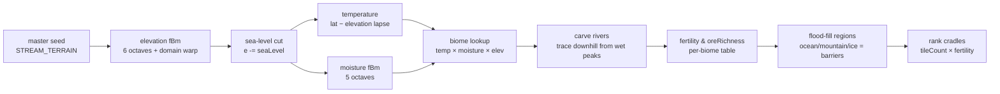
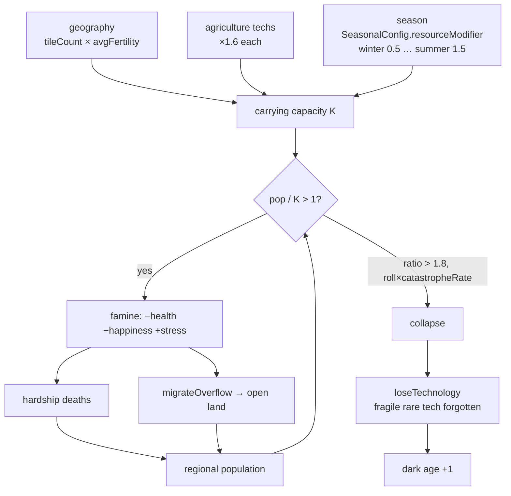

# 08 — World & Environment

*A hand-rolled, fully seeded procedural planet — elevation noise to biomes to isolated cradles — that turns climate and geography into a genuine survival gate, then closes a Malthusian loop where famine feeds back into death, migration, and lost technology.*

ASHB2's world layer answers the question *"why does every run diverge?"* with geography. A master seed grows a 200×150 tile planet (continents, rivers, biomes), flood-fills it into separated land basins, seeds one starting band per cradle, gives each cradle its own procedural language, and then lets carrying capacity, seasons, and harvest luck grind on the population. It is entirely algorithmic — **no LLM, no external noise library** (`Noise.cpp` is 55 lines of hand-written value noise + fBm). This document maps the whole pipeline against the actual code and is candid about which of the two environment systems is live and which is elaborate dead code.

## By the numbers

| Metric | Value | Source |
|--------|-------|--------|
| Grid size | **200 × 150** (30,000 tiles) | `main.cpp:1742` (`generate(seed,200,150,…)`) |
| Entity pixel-space extent | 1400 × 1050 | `main.cpp` `width/height`; `Planet.h:45` |
| Biomes | **9** (Ocean, Coast, Ice, Tundra, Desert, Grassland, Forest, Jungle, Mountain) | `Planet.h:8-18` |
| fBm octaves | elevation **6**, moisture **5**, domain-warp **3** | `Planet.cpp:41-51` |
| Seed sub-streams | **8** (`TERRAIN/CULTURE/INNOV/DISEASE/NAMES/SPAWN/MIGRATION/SOCIAL`) | `WorldSeed.h:14-23` |
| DivergenceConfig knobs | **4** (`butterfly`, `innovationLuck`, `catastropheRate`, `migrationPressure`) | `WorldSeed.h:26-31` |
| Primal resources | **6** (Food, Wood, Stone, Metal, Water, Herbs) | `ResourceSystem.h:13-21` |
| `src/world/` module | **12 files, ~1,332 LoC** (Noise, Planet, PlanetView, Lexicon, Ecosystem, ResourceSystem) | `wc -l` |
| `EnvironmentModel.cpp/.h` | **996 LoC** — of which only `EnvironmentalState`+`SeasonalConfig` are live | `src/environment/` |
| `EnvironmentalInteraction.cpp` | **526 LoC — entirely dead** (never instantiated) | grep |
| Real run A: habitable regions | **1 of 26** (3.85%); harvest **6 bountiful / 80 ordinary / 12 famine**; 35 hardship deaths | `plans/28.06.2026_22h17.md` |
| Real run B ("Sythanis") | planet hash `14093381856162214081`; **3 of 14** habitable; cradles (178,90),(10,28),(65,136); 25 famine seasons, 2 starvation deaths | `plans/29.06.2026-12h43.md` |

## The generation pipeline

`Planet::generate` (`Planet.cpp:11-68`) runs a classic, well-trodden sequence, all seeded from `STREAM_TERRAIN` sub-streams (indices 1/2/3/7/99 give independent noise fields and layout config):

- **Elevation** — `elevN.fbm(u+wx, v+wy, 6)` with a second `warpN` field domain-warping the coordinates for non-grid-aligned coastlines (`Planet.cpp:41-44`). An edge falloff biases the map borders below water so continents don't run off-screen (`:46-48`). A per-seed `seaLevel` (`-0.10 ± 0.07`) and `continentScale` (2.6–4.4) mean each seed gets a different land/ocean ratio and continent count.
- **Temperature** — `lat − max(0,e)*0.45`, warm equator / cold poles with an altitude lapse (`:54`). Latitude is `1 − |ny−0.5|·2`.
- **Biome** — a pure lookup on elevation×temperature×moisture (`assignBiomes`, `Planet.cpp:71-107`): ocean below sea level, a coast band, ice/mountain above 0.62 elevation, then tundra/desert/grassland/forest/jungle by the temp/moisture cross. Each biome also stamps `fertility` and `oreRichness` from a fixed table (grassland 0.85 food, mountain 0.90 ore, desert 0.10 food, etc.).
- **Rivers** — `carveRivers` (`:111-139`) drops ~`W*H/900` sources on wet highlands, then walks each to its lowest 8-neighbour until it hits the sea or a local minimum, marking `river=true` and bumping valley `fertility +0.15`.
- **Regions** — `labelRegions` (`:142-191`) flood-fills only over `isPassable()` land (`isPassable = isLand && biome != MOUNTAIN && biome != ICE`, `Planet.h:31`). **This is the divergence engine**: a single continent split by a mountain range or ice cap becomes several separate `regionId`s — the real-Earth mechanism for independent cultures. `summariseRegions` then scores each region and marks it `habitable` if `tileCount >= max(15, W*H/700)` and `avgFertility > 0.13`.

## Geography → isolated cradles → divergence

Spawning does not drop one blob; it seeds **one starting band per cradle**. `pickCradlePoints(k, rng)` (`Planet.cpp:247-289`) does farthest-point sampling over fertile passable tiles, so even a single-continent world gets well-separated cradles — isolation then emerges from distance + barriers exactly like independent civilizations across one landmass. `main.cpp:1767-1806` places bands at those points and stamps each entity's `originRegionId`. Because migration (`migrateOverflow`, `CivilizationEngine.cpp:1523`) only steps across `isPassable()` tiles, oceans and mountains stay barriers and continental isolation persists until a seafaring innovation — the mechanism that keeps far regions culturally alien. See [07-civilization-engine.md](07-civilization-engine.md) for how biome then drifts tribe values (harsh tundra → militarism, river valley → innovation) and how tech is exchanged only on contact.

Real runs show the payoff plainly: run B's planet "Sythanis" had **3 of 14 regions habitable**, forcing three cradles into proximity and — the post-mortem argues — breeding the social competition that dominated its history. Run A was harsher still: **1 habitable region of 26**.

## Seeded determinism & the planet hash

Everything random flows from `WorldSeed` (`WorldSeed.h`). `makeStream(master, salt, index)` mixes the master seed with a stream salt through `splitmix64` to build an independent `mt19937_64` per subsystem, so terrain, names, and migration never fight over one generator (`WorldSeed.h:51-54`). At startup `main.cpp:1711-1736` reads a text/number seed (numeric stays literal, text is FNV-1a hashed), sets the four `DivergenceConfig` chaos knobs, and deterministically reseeds `BetterRand` and `srand`. `Planet::hash()` (`Planet.cpp:333-340`) FNV-folds every tile's elevation+biome into a 64-bit fingerprint — **same seed → identical planet hash** (verified headless per the plan; run B logged hash `14093381856162214081`).

The **replay gap** the plan (2026-06-13) flagged — `FreeWillSystem/PlanningSystem/SemanticMemory/LearningAdaptation` self-seeding from `random_device` — has since been **largely closed**: those systems now draw from `nextDeterministicSeed()` (`WorldSeed.h:67`, used in `PlanningSystem/SemanticMemory/LearningAdaptation/implem_free_will`). The remaining `random_device` uses are the intentional "blank seed = random world" default (`main.cpp:1711`) and a static default in `BetterRand.h:27` that is overwritten by the deterministic `reseed` at `main.cpp:1733`. The residual fragility: `nextDeterministicSeed` is a **static counter keyed on construction order** and assumes single-threaded construction (documented caveat, `WorldSeed.h:65-66`) — concurrent construction would still lose bit-exact replay. See [10-infrastructure-and-postmortem.md](10-infrastructure-and-postmortem.md).

## Per-region language drift (Lexicon)

`Lexicon` (`world/Lexicon.cpp`, 153 LoC) gives every region its own phonotactics. `initRegions` mints a `Language` per region — a sampled inventory of onsets, nuclei, codas, and sex suffixes drawn from master pools via a seeded Fisher-Yates (`Lexicon.cpp:42-61`) — so names from region A sound distinct from region B (the "alien but familiar" feel). It is fully wired: `genName` names every entity and newborn (`Entity.cpp:119`, `implem_free_will.cpp` births), `genTribeName`/`genReligionName` name tribes/religions and kinship houses (`CivilizationEngine.cpp:1778,1801`, `Kinship.cpp:30`). Two evolutionary hooks fire live: `drift` mutates a random region's inventory every 40 days (`CivilizationEngine.cpp:88-90`) for slow sound change, and `blend` creolises the loser's language into the victor's on conquest (`:1718`) — languages diverge, then merge, like real families.

## The Malthusian loop (live)

The carrying-capacity loop lives in the **civilization** engine, not the environment module. `updateCarryingCapacity` (`CivilizationEngine.cpp:1571-1650`) is the load-bearing code:

`K = tileCount · avgFertility · 0.06 · agTechMultiplier · seasonMod` (`:1614`). When `pop/K > 1`, everyone in the region loses health/happiness and gains stress in proportion to the overshoot (`:1620-1631`), and `migrateOverflow` walks a slice of the population toward the emptiest habitable region across passable tiles (`:1523-1568`). Sustained overshoot (`ratio > 1.8`) rolls — scaled by `catastropheRate` — a **collapse** that calls `loseTechnology` (`:1504-1521`), which erases a fragile, rarely-known innovation (`knowerCount ≤ 2 && complexity > 45`) and increments `darkAgeCount`. That is the collapse → dark-age → recovery arc: knowledge is genuinely lost and must be rediscovered. The season term is where the *once-dead* `EnvironmentModel` actually earns its keep — `SeasonalConfig::fromMonth(month).resourceModifier` (`EnvironmentModel.cpp:21-49`) supplies the 0.5–1.5 winter/summer swing.

At the individual level, `updateEnvironment` (`main.cpp:57-95`) advances the day, rolls annual **harvest luck** (12% drought=0.45×, 10% poor=0.70×, 10% bumper=1.45×, else 1.0×) into `g_seasonalFoodModifier`, and that modifier flows straight into food production in `implem_free_will.cpp:2911-2940` — closing climate → yield → hunger → death. This is the harvest ledger the post-mortems tally (run A: 6 bountiful / 80 ordinary / 12 famine). See [03-entity-and-psychology.md](03-entity-and-psychology.md) for the hunger↔food-store metabolism this feeds.

## Ecosystem & resources (live) and disease

Two per-region survival layers sit under the loop and **are wired**:

- **`ResourceSystem` (`g_resources`)** — one `ResourcePool` per region with six resource ceilings derived from tile biome/fertility/ore/rivers (`ResourceSystem.cpp:20-60`). Stocks regenerate daily (food/herbs scale with season), over-extraction *degrades* the ceiling (deforestation/soil exhaustion) and fallow rest heals it. Foraging draws food from it (`implem_free_will.cpp:2916-2921`); crafting draws wood/metal (`CivilizationEngine.cpp:1285`).
- **`EcosystemSystem` (`g_ecosystem`)** — the actual **predator–prey model** (`world/Ecosystem.cpp`, 120 LoC): three trophic levels (plants → herbivores → predators) per region, updated with logistic plant regrowth, grazing, births/starvation/predation (`:43-75`). Agents hunt (`huntPressure`) and forage (`foragePressure`) against it; `gameAbundance`/`forageAbundance` scale yields (`implem_free_will.cpp:2928-2940`). A drought starves the chain bottom-up; overhunting collapses it top-down — the bridge from climate to famine.
- **Disease** (`Disease.cpp`, 105 LoC) is a separate, simpler contagion model: `calculateDisease` gates infection on hygiene, crowd size, sick neighbours, and antibodies; `manageSickness` drains health until antibodies clear it. It is *not* seed-threaded through the world layer (it uses `BetterRand`), and post-mortems note most "disease" deaths are actually the age-gated cancer path that bypasses the cure system.

## What is live vs. dead

**Live:** `WorldSeed` + 8 streams + `DivergenceConfig`; `Planet::generate/hash/pickCradlePoints`; `PlanetView` World-Map + History panels (GLFW mode only); `Lexicon` (names, drift, blend); `ResourceSystem`; `EcosystemSystem`; `EnvironmentalState`+`SeasonalConfig` (seasons, harvest luck); the `CivilizationEngine` carrying-capacity/migration/dark-age loop.

**Dead (compiled, never instantiated):**
- **`EnvironmentModel.cpp` — ~two-thirds dead.** `WorldEnvironment`, `ResourceManager`, `CulturalTransmissionSystem`, `InstitutionalSystem`, and `EnvironmentalFeedbackSystem` have **zero call-sites** outside the file itself (verified by grep). The three feedback loops (`setupPopulationPressureLoop/…ResourceDepletion/…ClimateFeedback`, `:556-610`) are **no-op stubs anyway** — their sensors `return 0.5f` and their effects do nothing. `ResourceManager`/`CulturalTransmissionSystem` were superseded by the leaner `world/ResourceSystem` and `Lexicon` (per the plan, "the same goal with far less glue and risk"). Only `EnvironmentalState` + `SeasonalConfig` survive as live wiring.
- **`EnvironmentalInteraction.cpp` (526 LoC) — entirely dead.** `EnvironmentalInteractionSystem`, `ResourceNode`, `TechnologyAdoption`, `InstitutionalParticipation`, `EnvironmentalBelief`, `ConsumptionPattern` are never instantiated anywhere in `src/`. It is an alternate, individual-level environment-psychology design that was never plugged in.

The honest summary: the environment *feedback* the sim actually feels comes from ~200 lines of live glue (seasons + harvest luck + carrying capacity) plus the `world/` module — not from the 1,500+ lines of `environment/` and `EnvironmentalInteraction` scaffolding, which stand as an abandoned first draft.

## Ideas worth stealing for petri-dish-of-madness

- **Deterministic seeded planet with barrier-based region isolation → emergent divergence.** One `Planet::hash()` fingerprint proves reproducibility; flood-fill over *passable* land (mountains/ice/ocean as walls) manufactures separate cradles from one master seed. Cheap, and it's the whole reason runs diverge.
- **Hand-rolled fBm, zero dependencies.** 55 lines of value noise + fBm with a domain-warp pass gives continents, rivers, and biomes. Worth copying instead of pulling a noise library into a research sim.
- **Per-region procedural `Lexicon` with drift + creolisation.** A sampled phoneme inventory per region, mutated on a timer and blended on conquest, makes names carry cultural history for ~200 LoC — a huge "alive" payoff.
- **A carrying-capacity collapse loop that actually loses tech.** `pop/K` overshoot → famine → migration → collapse → `loseTechnology` → dark age is a tight, legible Malthusian feedback that produces real rise-and-fall arcs. Steal the shape; but keep the loop with the population it governs (ASHB2's lives in the civ engine, not the elaborate `environment/` module that rotted).
