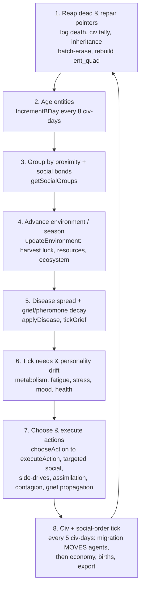
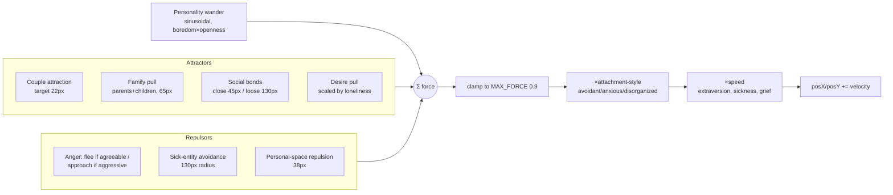

# 09 — Simulation Loop & Rendering

*How one 2,000-line `main.cpp` reaps the dead, ticks every mind, advances the seasons, and paints it all through a GLFW+ImGui statistics stack — plus the force model and quadtree that ship in the tree but never actually run.*

This document traces the heartbeat of ASHB2: the ordered per-tick pipeline in `updateSimulationStep`, the (dormant) force-directed movement model, the proximity/social grouping that feeds the decision engine, the circular social-graph view versus the spatial planet map, and the dual render-backend architecture.

## By the numbers

| Metric | Value | Source |
| --- | --- | --- |
| `main.cpp` | 2,067 LoC | `src/main.cpp` |
| `UI.cpp` | 1,101 LoC | `src/UI.cpp` |
| Vendored ImPlot (dependency, not analyzed) | 11,775 LoC | `src/header/implot*.{h,cpp}` |
| Update-pipeline stages | 8 major | `updateSimulationStep` + `applyFreeWill` |
| Force types in the movement model | 8 | `updateMovement` (`main.cpp:660`) |
| ImGui panels drawn per frame | 8 (+ social-graph overlay) | `UI.cpp` / `world/PlanetView.cpp` |

## The frame loop

`main()` (`src/main.cpp:1667`) is a console wizard first: it asks for entity count, a **rendering choice** (`getRenderingChoice`, `main.cpp:1653`), a world seed, and a chaos level; generates the planet, resources, ecosystem, lexicon, and starting cradles; spawns entities near those cradles (`main.cpp:1803-1809`); then constructs `globalCivEngine = new CivilizationEngine()` (`main.cpp:1944`), the kinship system, and the social order.

The whole real-time simulation then lives inside the `renderingType == 1` branch (`main.cpp:1976`). That is the GLFW/ImGui loop:

```cpp
while (!glfwWindowShouldClose(window)) {
    glfwPollEvents();
    ImGui_ImplOpenGL3_NewFrame(); ImGui_ImplGlfw_NewFrame(); ImGui::NewFrame();
    updateSimulationStep(entities, ent_quad, close_entity_together, day, ...);
    // ... draw all panels ...
    ImGui::Render(); glfwSwapBuffers(window);
}
```

One `updateSimulationStep` call per rendered frame; `glfwSwapInterval(1)` vsyncs to the monitor, so the sim advances at display refresh (~60 fps). The simulation is *frame-rate coupled*: a `frameCounter` gates the heavy logic to fire once every `UPDATE_FREQUENCY = 60` frames (`main.cpp:1975`), i.e. roughly once per second. Slower hardware = slower in-game time.

## The per-tick pipeline

`updateSimulationStep` (`main.cpp:1404`) is the top of the pipeline; the middle stages live in `applyFreeWill` (`main.cpp:836`), which it calls. Ordered stages, as actually executed:



1. **Reap the dead & repair pointers** (`main.cpp:1409-1504`). Dead entities (`entityHealth <= 0`) are logged, counted into `globalCivEngine->totalDeaths`, and their estate passed to an heir via `SocialOrderSystem::onDeath`. Because raw `Entity*` cross-references would dangle after `vector::erase` shifts elements, the code snapshots address→id, nulls pointers to the dead, batch-erases, rebuilds `ent_quad`, then repairs every `pointedEntity` via id lookup. This defensive dance is the single most fragile part of the loop.
2. **Age entities** — birthdays fire once every 8 civ-days (`main.cpp:1516`), gated so aging can't run every frame.
3. **Group by proximity + social bonds** — `getSocialGroups(ent_quad)` (`main.cpp:319`) builds the interaction clusters the decision engine operates on: each seed entity gathers people it has a social bond with (`searchConnSocial > 5`), everyone within **120 px** (proximity encounters, no bond needed), plus 1–2 random strangers (chance encounters). Groups cap at ~12.
4. **Advance environment / season** — `applyFreeWill` opens by calling `updateEnvironment(day)` (`main.cpp:57`): one in-sim day passes, the season/temperature update, an annual `g_harvestLuck` roll decides famine/bumper years, and regional resources + the food chain regrow. See `08-world-and-environment.md`.
5. **Disease + grief decay** — per entity: `applyDisease` spreads infection based on group size and nearby sick count; `tickGrief` recovers mourning; pheromones decay.
6. **Tick needs & personality drift** (`main.cpp:916-1015`) — the big per-entity block: hygiene decays, stress/boredom/loneliness build (rates keyed to Big-Five traits), happiness drifts toward a personality setpoint, **metabolism** burns `foodStore` (cold seasons cost more) or starves, and **fatigue** frays the mind. This is the tick that `03-entity-and-psychology.md` describes.
7. **Choose & execute actions** — a `context.situationHint` is built from proximity (couple_nearby, enemy_nearby, family_nearby, desire_nearby), then `sys.chooseAction(entity, neighbors, context)` picks an action and `executeAction` runs it (`main.cpp:1187-1391`). Pointed actions (`Socialize`, `Murder`, `couple`, `Trade`, `DeclareWar`…) select a target via `selectSocialTarget`; romantic and hostile *side-drives* fire probabilistically; `pointedAssimilation` mutates relationships; a murder propagates **grief** to everyone bonded to the victim; `processSocialConsequences` and `applyEmotionalContagion` close the loop. This is the engine of `04-free-will-decision-engine.md`.
8. **Civ + social-order tick, economy, births, export** (`main.cpp:1536-1618`) — every 5 civ-days `globalCivEngine->tick` and `globalSocialOrder->tick` run (`07-civilization-engine.md`); the market updates supply/demand; `get_new_borns()` appends babies (and repairs pointers again); `exportTickHistory` streams JSON-lines for an external HTML viewer. Then `day++`.

## Force-directed movement — written, but dormant

`updateMovement` (`main.cpp:660-834`) is a complete force integrator. For each entity it sums **eight force types**:



It is a genuinely thoughtful model: couples pull to a tight radius, families to a looser one, introverts flee crowds, the agreeable flee enemies while the aggressive charge them, attachment style scales the whole vector (avoidant dampens, anxious amplifies, disorganized flips sign periodically), and speed drops when sick or grieving.

**The honest catch: `updateMovement` is never called.** A repo-wide grep finds only its definition. The same is true of the quadtree's `getCloseEntityGroups` (see below) and the older `Movement` class in `src/movement.cpp` / `Movement.h` — three movement code paths, none wired into the shipped tick. At runtime, `posX/posY` change only via (a) initial cradle placement at spawn, and (b) **civ-engine migration** (`CivilizationEngine.cpp:1556`), which steps over-capacity agents toward new regions across passable land tiles. So spatial position is mostly static clustering plus slow migration — the elegant force layout is aspirational code.

## The quadtree — also infrastructure, also unused

`src/SpatialMesh.{h,cpp}` implements a real `QuadTree` (AABB nodes, `MAX_CAPACITY = 4`, `MAX_DEPTH = 8`) with `insert`, `query`, and `queryRadius`, plus `getCloseEntityGroups` that builds the tree and BFS-floods proximity clusters — the textbook way to make neighbor-finding `O(n log n)`. It is fully written and never called. The grouping that actually runs, `getSocialGroups`, is a brute-force **O(n²)** double loop over all entities. For the default ~40 entities this is fine; the quadtree is latent performance headroom for larger worlds, not an active optimization.

## Social graph vs. spatial map — two different geometries

A key design point: **the main visualization is not spatial.** `UI::DrawGrid` (`UI.cpp:543`) renders a **circular social graph**. `computeSocialLayout` (`UI.cpp:495`) ignores `posX/posY` entirely — it arranges *tribes* around a big circle and each tribe's members around a sub-circle, purely from `tribeId`. Relationship links are drawn on top: gold for couples, pink for desire, red for anger, cyan for social bonds, alpha-weighted by strength, capped at 40,000 lines for responsiveness. Dots are filled by happiness and ringed by tribe color.

`posX/posY` are used in only two places: the **quadtree/grouping proximity** math and the **World Map** panel (`DrawPlanetWindow`, `world/PlanetView.cpp:25`), which projects each entity's world coordinates onto the procedural planet grid (`worldToGrid`). So ASHB2 deliberately separates *who relates to whom* (circular, social) from *where bodies stand* (planet map) — the same population, two orthogonal layouts.

## Panel inventory (GLFW/ImGui mode)

Every frame the loop draws (`main.cpp:2005-2047`):

- **=== Stats + Save ===** — `showSaveLoadButtons` (`UI.cpp:35`): day/population/tick readout + save/load.
- **MIND BOARD** — `ShowMindBoard` (`UI.cpp:973`): scrollable cards of each mind's state; click to select.
- **Entity Statistics** — `ShowEntityWindow` (`UI.cpp:131`): full stat dump for the selected entity, an **Action statistics** sub-window, and an **ImPlot** time-series of stats over ticks (`UI.cpp:278`).
- **CIVILIZATION** — `ShowCivilizationPanel` (`UI.cpp:675`): tribes, innovations, events.
- **MARKET** — `ShowMarketPanel` (`UI.cpp:928`): supply/demand/prices.
- **World Map** — `DrawPlanetWindow`: entities plotted on the procedural planet.
- **History & Report** — `DrawHistoryWindow` (`world/PlanetView.cpp:94`): color-coded event log.
- **Social graph overlay** — `DrawGrid`, drawn on the ImGui background draw-list, pannable via `g_graphPan`.

`ImPlot` (vendored, 11,775 LoC across `implot.cpp` / `implot_items.cpp` / headers) is pulled in solely for the entity stat charts — treat it as a dependency, not part of ASHB2's own code.

## The dual-backend architecture

`getRenderingChoice` offers two modes, but only one is real:

- **Mode 1 — GLFW + ImGui "statistics"** (`main.cpp:1976`): the full dashboard above. This is the product.
- **Mode 2 — pure SDL** (`main.cpp:2063`): the `else` branch's only statement, `initialiseSDL(...)`, is **commented out**. `src/SDLEngine.{h,cpp}` is a working SDL2 window/renderer wrapper (with an `Image` blitter for a background), and the driver `initialiseSDL` (`main.cpp:1624`, itself commented out) shows the intent — run `updateSimulationStep` and blit sprites. But as shipped, choosing "2" runs *no* window: the sim simply doesn't start. Effectively there is one backend; SDL is scaffolding.

## Performance & honesty

- **God-file coupling.** `main.cpp` is 2,067 lines mixing console setup, world generation, the death-reaper, the force model, grouping, the entire needs/action pipeline, and the render loop. `updateSimulationStep` alone threads eleven mutable references. `refactor_main.py` in the repo root is evidence someone wants this split.
- **Dead subsystems.** The force integrator, the quadtree, the `Movement` class, and the SDL backend are all fully written and all unused. They inflate the LoC and mislead a reader into thinking the world has emergent physical motion; in practice motion is cradle clustering + civ migration.
- **Frame-rate coupling & headless limits.** Sim speed follows vsync, and the SDL "headless" path doesn't render at all. Per the project's own `alternate-earth.md` notes, verifying long-run behavior needs a real desktop with the GLFW window open — there is no headless tick-N-and-dump harness, so multi-generation runs can't be batch-validated in CI.

## Ideas worth stealing for petri-dish-of-madness

- **The ordered, deterministic tick pipeline.** One function, one fixed stage order (reap → group → environment → needs → decide → civ/economy/births), seeded RNG throughout — reproducible runs from a single seed. Copy the *shape*, but make each stage a real object so it doesn't become a 2k-line god-file.
- **Separate the social-graph view from the spatial map.** Rendering "who relates to whom" as a tribe-clustered circular graph *and* "where they stand" as a map — from the same entities — is a genuinely good UX idea for an agent sim.
- **Force-directed social/spatial layout + quadtree proximity.** The force model (typed attractors/repulsors, attachment-style multipliers) and the quadtree are worth stealing *and actually wiring in* — ASHB2 wrote both and forgot to call them; a petri dish that runs them gets emergent flocking/avoidance for free.
- **Stream a tick-history JSONL for out-of-process viewers.** `exportTickHistory` decouples simulation from visualization — the sim can feed a web viewer, a notebook, or a replay tool without touching the render loop.
