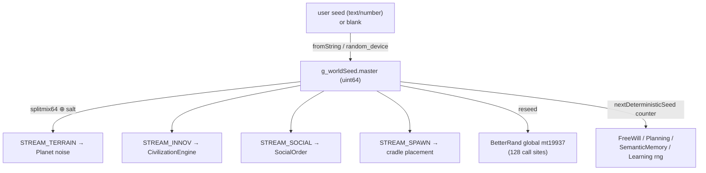
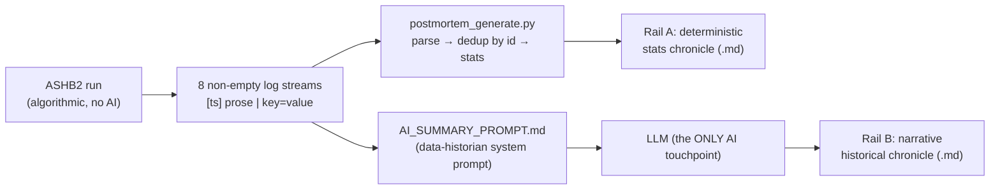

# 10 — Infrastructure & the Post-Mortem Pipeline

*The cross-cutting plumbing — seeded RNG, save/load, a structured event-log stream, and the dormant observability/validation/scalability scaffolding — plus ASHB2's one genuinely striking idea: turning raw log files into an AI-authored historical chronicle after the run ends.*

---

## Why this document matters

Everything in documents 01–09 describes what the simulation *does* inside a tick. This one is about what surrounds the tick: how a run is made reproducible, how it is written to disk, how it is observed, and — the highlight — how the raw exhaust of a run (eight append-only log files) is refined into a narrative post-mortem by an LLM. That last capability is the **only** place any AI touches ASHB2. The sim itself is 100% algorithmic; the intelligence lives entirely in an offline reporter that runs after the world is already dead.

---

## 1. Determinism & RNG — better than the project's own notes claim

The determinism spine is `src/header/WorldSeed.h` (72 lines) + `src/WorldSeed.cpp` (29 lines). One global `g_worldSeed` (a `uint64_t master` + a `DivergenceConfig`) is set once at startup and salts everything downstream.

- **Named sub-streams.** `enum RngStream` defines eight golden-ratio-style salts (`STREAM_TERRAIN`, `CULTURE`, `INNOV`, `DISEASE`, `NAMES`, `SPAWN`, `MIGRATION`, `SOCIAL`) so independent systems never fight over one generator (`WorldSeed.h:14-23`).
- **Mixing.** `splitmix64()` (`WorldSeed.h:43`) mixes master ⊕ salt; `makeStream(master, salt, index)` (`WorldSeed.h:51`) builds an independent `mt19937_64` per stream, optionally per-region/entity. This is genuinely wired: `world/Planet.cpp` draws terrain/moisture/warp noise from `STREAM_TERRAIN`, `CivilizationEngine.cpp:65` uses `STREAM_INNOV`, `SocialOrder.cpp:23` uses `STREAM_SOCIAL`, and `main.cpp:1767` seeds cradle placement from `STREAM_SPAWN`.
- **Per-object seeds.** `nextDeterministicSeed(salt)` (`WorldSeed.h:67`) mixes the master with a monotonic static counter to hand each cognitive object a distinct-yet-replayable seed. It explicitly documents its own caveat: *"assumes generators are constructed on a single thread… concurrent construction would lose determinism."*
- **Seed parsing.** `WorldSeed::fromString` (`WorldSeed.cpp:17`) keeps pure-digit input as the literal numeric seed and FNV-1a-hashes anything else, so `"Sythanis"` and `1646927876080465033` are both valid seeds.

### The replay gap — verified, and mostly already closed

The project's own notes (and doc-plan) flag `FreeWillSystem`, `PlanningSystem`, `SemanticMemory`, and `LearningAdaptation` as still self-seeding via `random_device`, breaking bit-exact replay. **That claim is now stale.** All four have been migrated to `nextDeterministicSeed`:

- `FreeWillSystem::FreeWillSystem() : … rng(nextDeterministicSeed(0xF2EEC0DE))` (`implem_free_will.cpp:647`)
- `PlanningSystem` → `nextDeterministicSeed(0x9111A11)` (`PlanningSystem.cpp:15,20`)
- `SemanticMemory` → `nextDeterministicSeed(0x53E34E3)` (`SemanticMemory.cpp:16,22`)
- `LearningAdaptation` → `static gen(nextDeterministicSeed(0x1EA24111))` (`LearningAdaptation.cpp:50`)

Moreover the workhorse RNG `BetterRand` (a single program-wide `mt19937`, used at **128 call sites** across `Entity`, `movement`, `implem_free_will`, `Disease`, `main`) is **reseeded from the master** at startup — `BetterRand::reseed(splitmix64(g_worldSeed.master ^ STREAM_SPAWN))` (`main.cpp:1733`) — and even C `srand()` is seeded from it (`main.cpp:1736`).

So the residual `random_device` calls are confined to three benign places:

| Location | Status |
|---|---|
| `main.cpp:1711-1712` | **Intentional** — the "blank seed = random" entropy source |
| `scalability/Scalability.cpp:163` (WorkStealer) | Dormant module, never runs during a sim |
| `validation/ValidationFramework.cpp:177,397` | Dormant module, never runs during a sim |
| `header/random.hpp:172` | Third-party `effolkronium` lib — **not referenced anywhere** in the sim |

**The honest residual risk is architectural, not seeding.** `BetterRand::gen()` is a *single shared global* generator, and `nextDeterministicSeed` depends on a *construction-order counter*. Bit-exact replay therefore holds only under identical single-threaded execution order; any nondeterministic iteration (unordered-map traversal, pointer-address ordering) or a future parallel entity loop would diverge two runs of the same seed. The world-generation layer (terrain, cradles) is solidly reproducible today; the agent loop is reproducible *in practice* but rests on that fragile ordering assumption.

---

## 2. Persistence — `SaveLoad.cpp`

`src/SaveLoad.cpp` (160 lines) is a deliberately dependency-free text serializer, not a binary format:

- `saveGame()` writes an `ASHB2_SAVE` header + `DAY`/`FRAME`/`ENTITY_COUNT`, then delegates each entity to `Entity::saveTo(file)`.
- `loadGame()` reconstructs entities with `Entity::loadFrom`, then does a **two-pass pointer fix-up**: all entities are loaded first, then `entity.resolvePointers(entities)` re-links relationship/partner/kin pointers by id (`SaveLoad.cpp:63-66`). This is the crux — the object graph is saved by id and rebuilt after the fact.
- `exportTickHistory()` is a separate hand-rolled JSON emitter (`SaveLoad.cpp:91`) that appends one line per tick capturing each entity's stats, Big-Five, value system, attachment, self-esteem, grief and current goal — a time-series feed distinct from the human-readable logs below.

Note the seed itself is **not** part of the save file, so a save/load resumes state but does not restore the RNG streams to their exact position — another reason replay is state-level, not stream-level.

---

## 3. Logging — the event stream that makes the post-mortem possible

`src/Logging.cpp` is a 5-line stub; the real logger is header-only in `src/header/Logging.h` (209 lines). A single global `Logger*` opens **ten append-mode files** under `./src/data/` and every domain call mirrors into a unified `complete_logs.txt`:

`cmd_log` · `births_log` · `deaths_log` · `diseases_log` · `actions_log` · `relationships_log` · `movements_log` · `events_log` · `civilization_log` · `complete_logs`

The design decision that makes this a *first-class event stream* rather than debug spew is the **stable parser contract** documented in the header itself. Every line is `[YYYY-MM-DD HH:MM:SS] <human prose>`, and the machine-mineable fields are appended after a ` | ` delimiter as `key=value` pairs so richer data can be added without breaking existing parsers (`Logging.h:73-88`, `145-165`). Highlights:

- **`logDeath`** writes one authoritative line — `Entity <id> (<name>, age <n>) died: <cause> | stage=… kids=… partnered=… mental=… hunger=…`. There is exactly **one call site** for it, enforcing the "one death = one line" invariant the post-mortem relies on.
- **`logCiv`** is the macro-history funnel: `CivilizationEngine::logEvent` (`CivilizationEngine.cpp:1959`) fans **24 call sites** into `civilization_log`, emitting 13 structured `kind=` tags (`tribe_founded`, `war_declared`, `battle`, `conquest`, `peace`, `alliance`, `rivalry`, `migration`, `famine`, `specialist`, `era_change`, `couples_broken`, `snapshot`). The `kind=snapshot` heartbeat (every 25 sim-days) carries running population/war/treaty tallies — the authoritative end-of-run totals.
- **`logMovement`** has **zero** call sites, so `movements_log.txt` is always empty (both sample post-mortems note this and exclude it).

This schema *is* the input contract for everything in §5. The logs are the API between the C++ sim and the Python/LLM reporter.

---

## 4. Observability / Validation / Scalability — compiled, dormant, aspirational

All three modules are listed in `CMakeLists.txt` and compile, but grepping for their namespaces outside their own directories returns **nothing** — none is wired into the sim loop. They are scaffolding for a future the project hasn't reached.

- **Observability** (`Observability.cpp`, 708 lines) — a genuinely complete design: `EventStreamManager` singleton, JSON/CSV `FileEventWriter`, a `CircularEventBuffer`, a `Profiler` with `PROFILE_SCOPE` macros, and an `AnalyticsEngine` (mean/variance/percentile/correlation/trend). It duplicates, in a cleaner structured form, what the header-only `Logger` already does — but the sim uses the `Logger`, not this.
- **Validation** (`ValidationFramework.cpp`, 600 lines) — the README claims "nothing checks emergent behavior is realistic," and the code confirms it. This is a *statistics toolkit* (two-sample t-test, chi-square, Pearson, R²) plus `SensitivityAnalyzer`/`CalibrationEngine`/`ValidationManager` whose actual fitness functions are literally `// Placeholder`, `// Dummy`, `predicted = observed * 0.9`. It validates **nothing about behavior** — there is no behavioral ground truth, no invariant suite, not even structural checks that run. This is **Gap 6** made concrete: the framework can compute a t-test, but nothing feeds it the "if psychology is right, these population patterns should self-emerge" targets the gap calls for.
- **Scalability** (`Scalability.cpp`, 385 lines) — `ThreadPool`, `ParallelEntityProcessor`, work-stealing, SoA `EntityStorage`, SIMD/GPU *interfaces* (the GPU class is a placeholder). Also unwired; the sim runs single-threaded, which is what keeps `nextDeterministicSeed` correct today.

Candid summary: these three add ~1,700 LoC of well-structured intent but **provide** nothing at runtime. The value ASHB2 actually ships is the humble header-only `Logger` + the offline reporter.

---

## 5. The post-mortem pipeline — the highlight

When a run ends you have eight non-empty log files. Two "rails" turn them into a report, both consuming the same schema from §3:

**Rail A — the deterministic analyst: `postmortem_generate.py` (31 KB, 742 lines).** Pure Python, no LLM. It parses seven logs (it ignores the empty `movements_log`), computes every statistic, and *itself writes* a stats-heavy Markdown report. Its core work:

1. **Parse** each log with one regex per line-shape (`TS_RE` peels the timestamp; per-file regexes extract founders, births, deaths, infections, couples, harvests, actions).
2. **Deduplicate deaths by entity id.** Each specific cause maps to a canonical `kind` + coarse `family` (`cause_kind`/`cause_family`, lines 130-157). When two rows collide on one id, a **priority map** keeps the most-specific/killing cause:

   > **crime of passion / murder (7) > disease / illness (6) > starvation / exposure / squalor (5) > despair / isolation / stress / exhaustion (4) > old age (2) > hardship (1)**

   (`postmortem_generate.py:161-179`). It reports the collision rate as a footnote — a real signal: the older `28.06` run shows **377 collisions / 53.93%** conflict rate, whereas after the engine moved to one-authoritative-death-line the `29.06` run shows **0%**. The dedup logic is what made the messy early logs usable at all.
3. **Compute stats** — population math (`founders + births − deaths = survivors`), mortality by cause/family, age distribution, killer leaderboards, couples & dynasties, disease infection/cure rates, harvest tallies, per-minute birth/death/infection timelines, and terminal-state correlations mined from the death `key=value` context (e.g. mean `mental` for despair vs. violence deaths).
4. **Emit** an ASCII-charted Markdown chronicle (executive summary → the world → demographics → **the Reaper's Ledger** → love/dynasties → plagues → the land → notable lives → timeline → closing → methodology). Output `28.06.2026_22h17.md` is verbatim this generator.

**Rail B — the AI data historian: `src/AI_SUMMARY_PROMPT.md` (15 KB) + an LLM.** This is the only AI in ASHB2. The raw logs are handed to an LLM under a long "data historian and quantitative analyst" system prompt that:

- Documents the **exact format of every log line** (including the full `civilization_log` `kind=` grammar Rail A doesn't parse), so the model mines structured fields rather than scraping prose.
- Prescribes **DATA HYGIENE first** (dedup by id, split on ` | `, "if a number can't be derived, write *not recorded* — never invent figures," state the population identity explicitly).
- Lists **what to compute** (mortality families, jealousy→crime-of-passion escalation rate, tribes/wars/faith/economy from `civilization_log`, dark ages, Malthusian famine correlations).
- Fixes a **16-section report structure** and aesthetic rules (Markdown tables, ≥2 Unicode bar charts, emoji as section icons only, a chronicler's voice where "every dramatic claim must trace to a number you computed"), ending in a methodology footer.

Output `29.06.2026-12h43.md` is this rail: richer interpretation the Python can't produce ("you were 193× more likely to be killed in a jealous rage than to die in bed"; attachment-style breakdowns; dynasty ASCII trees; the "violence was fully democratized — 772 unique killers" reading). Because that run had no tribal warfare, its `civilization_log`-driven sections (Tribes, Wars, Faith, Economy) are simply absent — the prompt's "never invent" rule holding.

The two rails are complementary, not chained: Rail A guarantees the arithmetic; Rail B adds the interpretation and the civilization-scale history. A natural future step is to feed Rail A's computed stats *into* Rail B's prompt so the LLM never has to re-derive a number.

### NarrativeEngine: live, but not the AI

Grep confirms `NarrativeEngine` (`NarrativeEngine.cpp`, 220 lines) **is** live — `applyFreeWill` calls `NarrativeEngine::actionToSentence(...)` every tick and pushes it into `globalNarrativeLog` for the UI panel (`main.cpp:1330-1335`). But it is a **template/string generator**, not an LLM: it turns an action enum into a canned English sentence and an "inner monologue" line. It is in-sim, deterministic, and unrelated to the post-mortem. The distinction matters: ASHB2 has *in-sim narration* (algorithmic) and *offline analysis* (the one LLM). Do not conflate them — the sim never calls a model.

---

## By the numbers

| Metric | Value |
|---|---:|
| Log files opened by `Logger` | 10 (8 domain + `civilization_log` + `complete_logs` mirror) |
| Logs parsed by Rail A / mined by Rail B | 7 / 8 (`movements_log` always empty) |
| `postmortem_generate.py` | 31 KB · 742 lines |
| `AI_SUMMARY_PROMPT.md` | 15 KB · 16-section spec |
| Dedup priority tiers | 6 (violence > disease > privation > collapse > old age > hardship) |
| Death-cause `kind=` mappings | 12 specific causes → 6 families |
| `civilization_log` structured `kind=` tags | 13 (24 call sites) |
| Observability.cpp / ValidationFramework.cpp / Scalability.cpp | 708 / 600 / 385 LoC — compiled, **dormant** |
| WorldSeed.cpp+.h / SaveLoad.cpp / Logging.h / NarrativeEngine.cpp | 101 / 160 / 209 / 220 LoC |
| Named deterministic RNG streams | 8 |
| Cognitive subsystems still self-seeding (replay gap) | **0 of 4** — all migrated to `nextDeterministicSeed` |
| Residual `random_device` | 1 intentional (blank-seed) + 2 dormant modules + 1 unused lib |

---

## Cross-references

- **`08-world-and-environment.md`** — `WorldSeed`, `STREAM_TERRAIN`, and how the master seed makes Planet generation reproducible.
- **`06-relationships-and-social-order.md`** — the "crime of passion / murder" deaths the dedup priority ranks highest, and the jealousy → violence pipeline the AI prompt reconstructs.
- **`13-frontier-assessment.md`** — the log-stream → AI post-mortem pipeline as the project's single most portable idea, and the dormant validation framework as the biggest unrealized gap (Gap 6).

---

## Ideas worth stealing for petri-dish-of-madness

- **Log-stream → AI post-mortem/chronicle (lead steal).** ASHB2 gets a compelling "historian's account of a dead civilization" for near-free: append-only, `key=value`-annotated event logs + a single long "data historian" prompt = a narrative chronicle with tables, bar charts, dynasties and a reaper's ledger. Petri-dish is already LLM-native, so this is almost free — define the log schema as a *contract* now, and the retrospective writes itself. Consider the two-rail split: a deterministic analyzer that guarantees the numbers, feeding an LLM that supplies the narrative, so the model never invents a statistic.
- **Structured event-log-as-contract.** The ` | key=value` convention and "one event = one authoritative line" invariant are what make both rails robust to schema growth. Treat logs as a versioned data interface, not debug output — new fields append without breaking old parsers, and dedup/priority rules live in the reader.
- **Master-seed fan-out with named sub-streams.** `splitmix64(master ⊕ salt)` per subsystem (`STREAM_*`) gives independent, reproducible streams from one user-facing seed — cheap to adopt and a huge win for "share a seed, reproduce a run." Pair it with an explicit single-thread/ordering discipline (ASHB2's real fragility) or a per-agent stream keyed by a stable id rather than a construction-order counter.
- **Don't build the dormant scaffolding first.** ASHB2 spent ~1,700 LoC on observability/validation/scalability modules that never got wired in, while the header-only `Logger` + a Python script deliver all the actual value. Ship the thin real thing; write the behavioral-ground-truth validator (Gap 6: "which population-level patterns should self-emerge?") before the SIMD thread pool.
