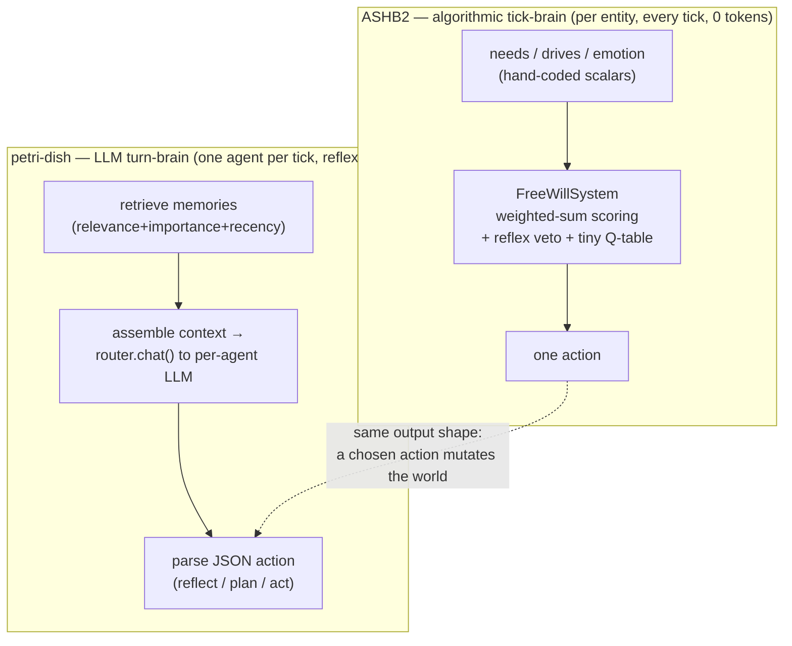

# 11 — ASHB2 vs. petri-dish-of-madness

*Two projects chasing the same dream — a society that lives itself into existence — from opposite engines. ASHB2 hand-codes a deterministic mind in C++ and runs thousands of them; petri-dish gives each of ~5–25 agents its own live LLM. This document lines them up honestly and marks what has already converged.*

## The one-paragraph framing

ASHB2 and [petri-dish-of-madness](/Users/johns/Projects/petri-dish-of-madness) are **the same animal grown from opposite genes**. ASHB2 is an *algorithmic* agent sim: every thought is a hand-written C++ rule, the whole run is deterministic and free of API calls, and it scales to thousands of entities producing tribes, religions, wars, and a narrated history. petri-dish is an *LLM-native* agent sim in the Stanford-Smallville → Project-Sid (PIANO) lineage: each villager runs its **own hot-swappable model** (the marquee feature), cognition is memory-retrieval + reflection + planning expressed in natural language, and scale is deliberately tiny (5 default, hard cap 25) with most ticks resolving as no-LLM "reflex." Crucially, **their overlaps are convergent evolution, not ports** — petri-dish inherited generative-agents ideas from `docs/research/smallville-to-sid-2026-06-18.md`, not from ASHB2. That makes the comparison useful in both directions: where they agree confirms the design; where ASHB2 goes deeper marks a real, non-redundant lesson.

## Two brains, side by side

Both compress "what should this agent do now?" into a single chosen action. ASHB2 pays microseconds and hand-tuned weights; petri-dish pays tokens and gains open-ended reasoning and language.

## Head-to-head

| Dimension | ASHB2 | petri-dish-of-madness | Note |
|-----------|-------|------------------------|------|
| **Language / stack** | C++17, CMake, GLFW+ImGui/SDL | Python 3.11 / FastAPI / SQLite + React/TS/Three.js | native app vs. web app |
| **Cognition engine** | Hand-coded rules, **no LLM in-sim** | **LLM per agent**, hot-swappable models | opposite premises |
| **Scale** | Thousands of entities | **5 default, cap 25** | 2–3 orders of magnitude apart |
| **Cost per run** | ~free (CPU only) | token-metered (free-tier economics, reflex-first) | ASHB2 wins on cost/scale |
| **Determinism** | Single-thread-only, seeded ([10](10-infrastructure-and-postmortem.md)) | **Byte-identical snapshots, fork/replay** (EM-155) | both strong; petri-dish's is more disciplined |
| **Individual psychology** | **Deep**: Big Five + attachment + needs + (dead) appraisal emotion ([03](03-entity-and-psychology.md)) | Free-text `personality` string + one `mood` label + three-needs (EM-229) | ASHB2 far deeper — but much is dead code |
| **Decision arbitration** | Weighted sum + reflex veto + Q-table ([04](04-free-will-decision-engine.md)) | LLM judgment, reflex-gated | different kinds of "good" |
| **Memory** | 64-dim semantic stream, biases scoring ([05](05-cognition-memory-planning.md)) | **Embedding retrieval + reflection + consolidation** (EM-222/080/233) | petri-dish's is the richer, canonical form |
| **Planning** | 1-ply template "ToT" ([05](05-cognition-memory-planning.md)) | Recursive+reactive LLM plan (EM-223, default off) | both shallow today; different ceilings |
| **Learning** | Tiny Q-table, ~24 buckets, not saved ([05](05-cognition-memory-planning.md)) | Skill xp / level-up → professions (EM-227) | neither has deep value learning |
| **Relationships** | 4-scalar proximity-decay dyads, Dunbar cap; **jealousy→murder** ([06](06-relationships-and-social-order.md)) | Typed `RelationshipState` + trust + **crime/justice engine** (EM-240) | ASHB2 has emergent romantic drama; petri-dish has structured crime |
| **Kinship / lineage / class** | Id-keyed registry, incest avoidance, classes, debt-slavery ([06](06-relationships-and-social-order.md)) | Children, life-stages, inheritance, renown-as-class (EM-114/126) | rough parity |
| **Civilization emergence** | **Tribes + religions + tech-tree + diplomacy + economy** ([07](07-civilization-engine.md)) | Economy + governance + factions shipped; **religion/ideology/culture designed, unshipped** (Wave O) | ASHB2 has more *shipped* macro-history; **no tech-tree in petri-dish** |
| **Procedural world** | **Seeded planet: fBm biomes, isolated regions, language drift** ([08](08-world-and-environment.md)) | Procgen town (roads/lots); **no biomes/terrain/planet** | ASHB2's geography-driven divergence is absent in petri-dish |
| **Collapse / history shape** | **Carrying-capacity → famine → tech-loss → dark age** ([07](07-civilization-engine.md)/[08](08-world-and-environment.md)) | none (monotonic) | ASHB2 has non-linear "history"; petri-dish doesn't |
| **Visualization** | Circular social graph + planet map (ImGui) | **3D town (Three.js) + force-graph + inspector/replay** | petri-dish's UI is stronger |
| **Narrative report** | **Offline log→AI post-mortem chronicle** ([10](10-infrastructure-and-postmortem.md)) | **Chronicle builder** from event log (EM-094) | both have it — convergent |
| **Build process** | Solo, hand-written | **Multi-agent contracts + wave builds + living plan** | petri-dish is orchestrator-built |

## Capability matrix (petri-dish status vs. ASHB2's depth)

From the petri-dish recon, mapped against ASHB2 capabilities:

- **PRESENT & canonical in petri-dish, shallower/dead in ASHB2:** memory stream + retrieval + reflection (EM-222/080/233); determinism/replay (EM-155); 3D + force-graph visualization; narrative chronicle (EM-094).
- **PRESENT in both (convergent):** relationships/factions/reputation; kinship/lineage/life-stages/inheritance; a reflex-gated action model; a crime layer (petri-dish EM-240 justice ≈ ASHB2 reflex-veto + crime-of-passion).
- **PARTIAL in petri-dish, DEEP in ASHB2:** individual psychology (petri-dish free-text vs. ASHB2 Big Five+attachment); planning (both 1-ply-ish); learning (both thin); civilization emergence (petri-dish has economy/governance but **no tech-tree, no collapse loop**; religion/ideology only *designed*).
- **ABSENT in petri-dish, PRESENT in ASHB2:** structured Big-Five/appraisal psychology; a genuine **zero-LLM decision brain**; per-agent **RL/Q-learning**; a **procedural planet** with geography-driven cultural divergence; a **tech-tree** and a **Malthusian collapse→dark-age** history arc; Kübler-Ross grief.
- **ABSENT in ASHB2, PRESENT in petri-dish:** real LLM cognition & language; per-agent **model bake-off / Arena**; a 3D web UI + replay/decision-trace inspector; multi-agent build infrastructure; a provider router with free-tier economics; a human-in-the-loop "god" layer and LLM chaos-animals.

## "Already integrated" — what to make of it

The user's premise ("we already integrated some ideas") holds, with a precise caveat: **the shared machinery arrived by convergence, not by copying ASHB2.** Concretely, petri-dish already has the generative-agents cognition (EM-222 retrieval, EM-223 planning, EM-224 PIANO multi-action), a crime/justice engine (EM-240) that rhymes with ASHB2's reflex-veto + crime-of-passion, a three-needs drive system (EM-229) that rhymes with ASHB2's needs, lineage/life-stages (EM-114/126), and a Chronicle/narrator (EM-094) that rhymes with ASHB2's post-mortem. Its *designed-but-unshipped* Wave O (EM-250–263: agent-invented ideologies, religion, culture-memes) and multi-city plans (EM-109/117/128) are exactly the places ASHB2's **already-shipped** tribes/religions/geography-divergence become a working reference implementation rather than a fresh design.

So the honest read: **ASHB2 is not a source to port from wholesale — it's a proven, zero-cost reference for the parts of petri-dish that are still on the drawing board, plus a supplier of a few genuinely novel substrates petri-dish lacks entirely.** Those are enumerated and ranked in [12-convergence-analysis.md](12-convergence-analysis.md) and [13-frontier-assessment.md](13-frontier-assessment.md).

## The asymmetry that matters most

ASHB2's biggest weakness is petri-dish's biggest strength and vice-versa:

- ASHB2 has **no semantic understanding** — its "minds" are scalar arithmetic, so its agents can never say or invent anything genuinely new. But it runs **thousands of them, deterministically, for free**, and it has a *shipped* world-and-civilization substrate.
- petri-dish has **real open-ended cognition and language**, but it's **expensive and tiny**, and much of its macro/world substrate is still design docs.

That asymmetry is the entire argument for the hybrid in [12-convergence-analysis.md](12-convergence-analysis.md).
