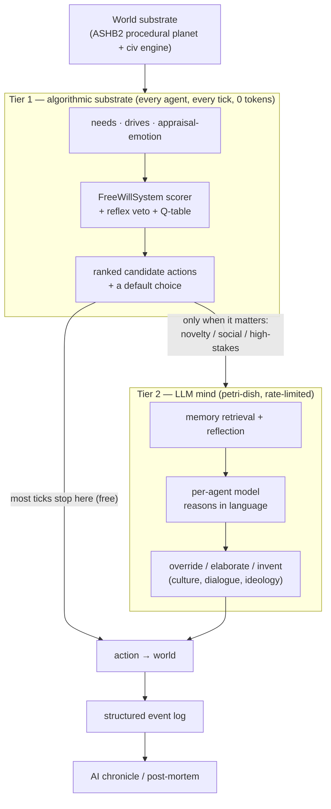

# 12 — Convergence Analysis

*ASHB2 and petri-dish are the two halves of one animal: a cheap, always-on algorithmic substrate and an expensive, open-ended LLM mind. This document sketches what each lacks, and what a system that fused them would look like.*

## The thesis: a two-tier brain

petri-dish already believes in the right architecture — it is **reflex-first**, reserving the LLM for decisions that genuinely need judgment, precisely to survive on free-tier economics. What it lacks is a *deep* reflex tier. That is exactly what ASHB2 is: a complete, deterministic "System 1" — needs, drives, emotion, relationship physics, a scored action set, civ aggregation, and a world — that never calls an API. ASHB2, conversely, has a magnificent System 1 and **no System 2 at all**: its agents can never reason about something they weren't hand-coded for, or say anything new.

Fuse them and you get the architecture neither project can reach alone:

The scorer produces grounded candidate actions and a safe default for free; the LLM is invoked *only* for the ticks that carry novelty, social nuance, or stakes — and when it is, it's choosing among (or overriding) legal, world-grounded options rather than hallucinating from a blank prompt. This is strictly better than either project's status quo: cheaper and more scalable than petri-dish today, and infinitely more expressive than ASHB2 ever could be.

## What petri-dish lacks that ASHB2 supplies

1. **A real zero-LLM brain.** ASHB2's `FreeWillSystem` ([04](04-free-will-decision-engine.md)) is a fast deterministic scorer with a reflex veto and a tiny Q-table. Dropped in as Tier 1, whole runs (or whole populations of "background" agents) can proceed at **zero tokens**, deepening petri-dish's existing mock/free-scale path from "random-ish reflex" to "personality physics."
2. **Structured psychology.** Big Five + attachment + an appraisal→emotion table ([03](03-entity-and-psychology.md)) replace petri-dish's free-text `personality` string and single `mood` label with **measurable, model-agnostic, deterministic** state — the same numbers can prompt the LLM *and* drive the scorer.
3. **Per-agent value learning.** ASHB2's Q-table ([05](05-cognition-memory-planning.md)) is a cheap way for an agent to acquire persistent, context-dependent preferences that an LLM (stateless across calls) cannot — a complement, not a competitor, to memory retrieval.
4. **A procedural planet.** fBm terrain → biomes → **isolated regions** → per-region language drift ([08](08-world-and-environment.md)) is the geographic substrate that would make petri-dish's *planned* multi-city cultural divergence (EM-109/117/128) genuinely emergent from geography instead of hand-seeded per city.
5. **Civilization-scale history.** A tech-tree (**absent** in petri-dish) and the carrying-capacity → famine → tech-loss → **dark-age** loop ([07](07-civilization-engine.md)) give a run the non-linear rise-and-fall shape that turns "a log of events" into "a history." Kübler-Ross grief ([03](03-entity-and-psychology.md)) adds the same non-linearity to individual lives.

## What ASHB2 lacks that petri-dish supplies

1. **Semantic cognition and language.** The entire reason to want an LLM: agents that can interpret novel situations, converse, and **invent** culture, religion, and ideology (petri-dish Wave O) rather than re-projecting hand-coded trait distributions.
2. **A disciplined replay contract.** petri-dish's EM-155 byte-identical, fork/replay determinism is stricter than ASHB2's single-thread-only global-RNG scheme ([10](10-infrastructure-and-postmortem.md)); it's the model ASHB2 should copy if it ever multi-threads.
3. **A modern observability surface.** A 3D world, a force-directed social graph, and an inspector with replayable decision traces — versus ASHB2's ImGui panels and a *dormant* force layer ([09](09-simulation-loop-and-rendering.md)).
4. **A build methodology.** Machine-readable contracts, wave builds, and a living-plan intake loop — the reason petri-dish can carry ~40 subsystems without the "ambitious-but-dead code" rot that pervades ASHB2 ([02](02-architecture.md) dead-code inventory).

## Convergence opportunities (bidirectional)

| # | Opportunity | Direction | Mechanism |
|---|-------------|-----------|-----------|
| C1 | **Scorer-as-Tier-1** | ASHB2 → petri-dish | Port `FreeWillSystem` scoring + reflex veto as the deterministic fallback beneath `router.chat()`; LLM overrides only on flagged ticks. |
| C2 | **Numeric psychology** | ASHB2 → petri-dish | Replace `personality` string with a Big-Five+attachment vector; feed it to *both* the scorer and the LLM prompt. |
| C3 | **Procedural planet** | ASHB2 → petri-dish | Add fBm biomes + region flood-fill under the town generator; seed multi-city culture drift from geography. |
| C4 | **Tech-tree + collapse loop** | ASHB2 → petri-dish | Give the economy a prereq-gated tech ladder and a carrying-capacity famine/tech-loss cycle for real history. |
| C5 | **Grounded-candidate prompting** | both | LLM chooses among the scorer's ranked legal actions → fewer illegal/hallucinated actions, cheaper prompts. |
| C6 | **Replay discipline** | petri-dish → ASHB2 | Adopt EM-155-style seeded, thread-safe determinism to make ASHB2 multi-threadable ([14](14-expansion-roadmap.md)). |
| C7 | **LLM narrator upgrade** | both already have it | Both turn a structured event log into an AI chronicle; standardize the log schema as the shared contract ([10](10-infrastructure-and-postmortem.md)). |
| C8 | **Wire-or-delete discipline** | petri-dish → ASHB2 | ASHB2 should adopt petri-dish's contract/intake rigor to stop shipping dormant subsystems. |

## The uncomfortable shared lesson

Both codebases independently discovered the **log-stream → AI-chronicle** pattern (ASHB2's post-mortem, petri-dish's EM-094) — strong evidence it's a genuine primitive of this genre, not a gimmick. And both independently drifted toward **reflex-first** execution to control cost/scale. The convergence analysis's punchline is that these two instincts point at the *same* combined design: **a deterministic substrate that runs almost everything for free, an LLM invoked sparingly for what only it can do, and an AI narrator that reads the exhaust into a story.** ASHB2 built the substrate and the narrator; petri-dish built the LLM mind and the narrator; the frontier ([13](13-frontier-assessment.md)) is assembling all three.
